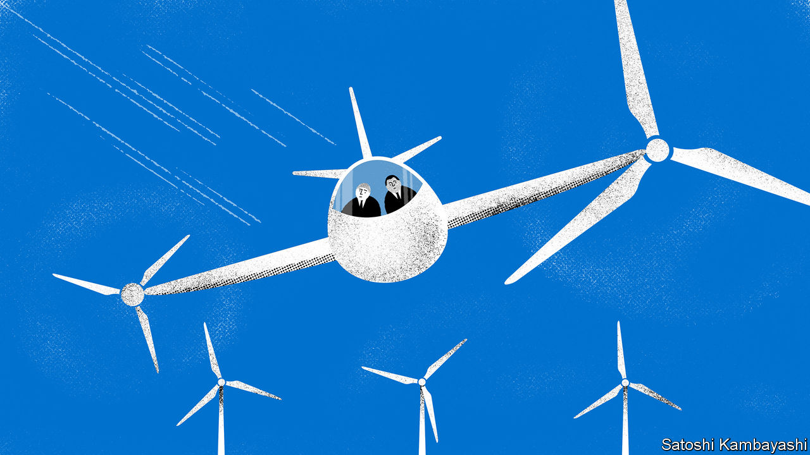

## Seeking scale

# Blended finance is struggling to take off

> Hopes that it will fill a trillion-dollar financing gap seem far-fetched

> Aug 15th 2020

ANDREW JOHNSTONE runs a fund that goes “where people have not gone before”. Launched in 2015, Climate Investor One finances renewable-energy projects that the market deems too risky, such as wind farms in Vietnam and hydropower facilities in Uganda. It uses grants from development agencies to attract capital from pension funds. That allows it to raise more cash. For every $1 in grants, it has secured $12 from the private sector.

The fund is an example of blended finance, where public or philanthropic money reduces the risk from investments for the private sector, using financial vehicles such as default insurance or loan guarantees. The mixed-up money either directly finances projects, often infrastructure in poor countries, or pays into a fund supporting many ventures. The idea took root in development circles in the late 2000s. Many still see it as a way for markets to plug the gap in financing the achievement of the UN’s sustainable-development goals, estimated to be a whopping $2.5trn a year.

Institutional investors, the thinking goes, gain exposure to emerging markets at a lower risk. Development institutions, such as the World Bank’s financing arm, marshal more capital. Ideally, blended finance would open up new markets. Once the viability of water-treatment plants in Kenya is shown, say, the private sector should fund similar projects by itself.

Yet blended finance has struggled to grow. Since 2014 the flow of public and private capital into blended projects and funds has stayed flat at about $20bn a year, according to data from Convergence, a non-profit organisation. That is far off the goal of $100bn set by the UN in 2015, which targeted climate-change spending and was meant to be met this year. Even some advocates admit that the approach is stalling.

What is going wrong? For one thing, institutional investors are reluctant to get involved. The asset class is unfamiliar. Projects are often bespoke, and too small to make the effort worthwhile; the median value was $50m in 2018. That raises another problem, says Jay Collins of Citigroup, a bank. Creating a blended structure requires financial wizardry. But the wizards tend to work for big financial firms with little interest in titchy deals. Getting blending right also requires trust on both the public and private sides, says Mr Johnstone. A culture clash may prohibit that. One portfolio manager describes working with the lumbering bureaucracies as “tortuous”.

Another stumbling block lies with the public institutions. On average multilateral development banks mobilise less than $1 of private capital for every public dollar, says Katherine Stodulka, of the Blended Finance Taskforce, a global body. That is partly because their internal workings incentivise grant-making above blending.

Viable projects are also hard to find. In poor countries governments struggle to make projects investor-ready, lacking for instance the expertise to do feasibility studies. Private investors want to make the most returns, for a given risk; grant-makers want the most impact. A blendedfinance project must balance the two, and there are few of those, says Christoph Kuhn of the European Investment Bank (EIB).

To help blended finance bloom, some development banks are working with poor governments to show that projects are viable. That costs 2-5% of the project spending (in consultancy fees and so on), but reassures investors. Mr Kuhn advises using blending techniques that are familiar to investors. The EIB is focusing on layering equity, where the public tranche takes the first loss if a project goes wrong, and guarantees against losses for banks.

Greater transparency could lure investors too. Data on deals are often confidential, so it is hard to tell what returns are normal and how many projects go bust. Development banks promise more disclosure (but investors doubt it will happen).

Such small fixes will encourage growth. But merging public and private money will always be hard, and early hopes may simply have been too starry-eyed. A trillion-dollar market seems well out of reach. Even making it to the hundreds of billions a year may be a stretch. ■

## URL

https://www.economist.com/finance-and-economics/2020/08/15/blended-finance-is-struggling-to-take-off
