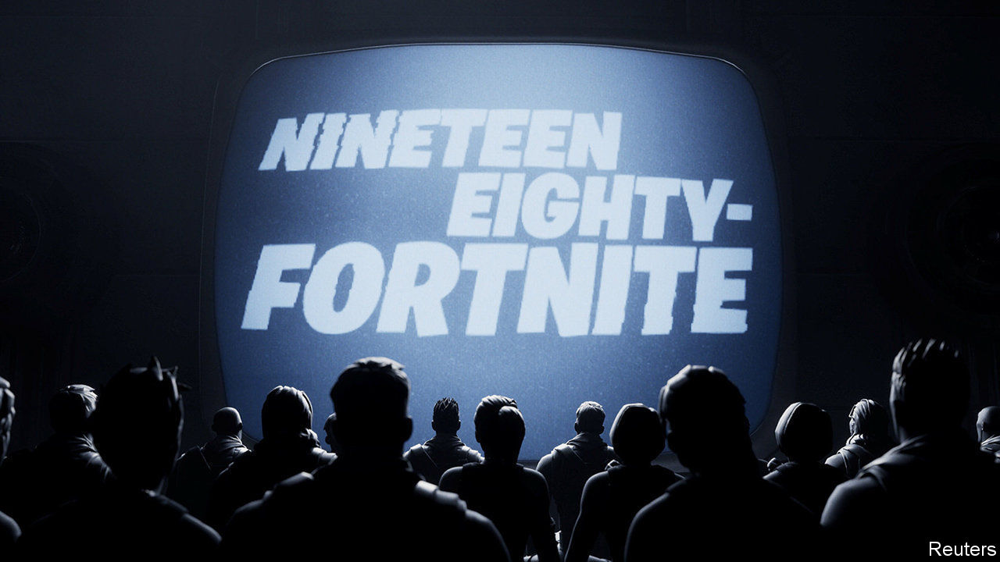

## Power play

# Epic Games takes on Apple

> The iPhone-maker is provoked into booting “Fortnite” from its App Store. There will be blood

> Aug 22nd 2020

IT WAS A surgical operation worthy of the best “Fortnite” players. On August 13th Epic Games goaded Apple into booting its hit game from the App Store. Within an hour of Apple’s decision, Epic launched an antitrust lawsuit against the tech giant. Epic’s slick parody of Apple’s famous “1984” advert now cast its enemy as the oppressive, grey Big Brother. 

Epic’s provocation was to offer users alternative payment methods for in-game goodies. Those who bought 1,000 V-Bucks, the game’s internal currency, via the App Store would cough up $9.99. Buy directly from Epic, which would thus avoid the 30% cut that Apple takes from every in-app transaction, and you pay $7.99. This dodge violates the App Store’s rules, hence the expulsion. The same day “Fortnite” was removed from Google’s Play Store, which serves users of Android phones, for the same reason.

At issue is the tight grip Apple exerts over its devices. The firm tries to ensure that the App Store is the only way for iPhone users to obtain software. This, Apple says, keeps apps kosher and secure. Critics allege that it stifles competition and allows Apple to hold app-sellers over a barrel. Unlike owners of Apple phones, Android users can buy software, including “Fortnite”, from various vendors, limiting Google’s power; in 2018 Epic launched its own web-based store for PC games, where it takes a 12% cut from developers.

App developers and companies from Airbnb to Match Group have had run-ins with Apple similar to Epic’s. Complaints from Spotify, a music-streaming service, and Kobo, which makes an e-book reader, have led to an EU antitrust probe. Shortly after Epic launched its lawsuit, Spotify and Match voiced their support for it. Epic claimed that a ban on “Fortnite” would threaten dozens of other iPhone games that have licensed its code.

On August 17th Apple said the App Store would welcome “Fortnite” back if Epic shelved its payments ploy. Tim Sweeney, Epic’s feisty boss, is unlikely to give up that easily.

## URL

https://www.economist.com/business/2020/08/22/epic-games-takes-on-apple
