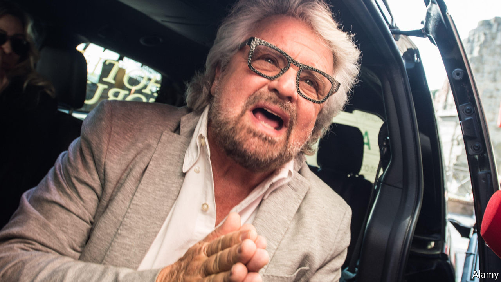

## Welcome to politics

# Italy’s populist Five Star Movement is becoming a more normal party

> Meanwhile, the far-right populists of the Northern League are losing popularity

> Aug 22nd 2020ROME

SOME SEE Italy’s anti-establishment Five Star Movement (M5S) as a destabilising force which, by refusing to ally itself with mainstream parties, logjammed Italian politics for years. Others see it as an eccentric but original group that genuinely cares about corruption, the environment and using digital technology to give ordinary people a voice in politics. Depending on which view you take, the online referendum of M5S’s members held on August 13th-14th was either a triumph or a disaster, because they ditched two of its core principles.

The M5S voted by four to one to modify a rule that limits members to a total of two terms in all elected offices. Henceforth, serving as a local councillor will not count—a change that will allow Virginia Raggi, the mayor of Rome and previously a city councillor, to run for a second term. The movement also voted 60% to 40% to drop its opposition to formal alliances with traditional parties, at least locally. That means M5S can link up with its government coalition partner, the centre-left Democratic Party (PD), at municipal elections on September 20th-21st. The poll represents a step back from populism in a country that has been pioneering it ever since Silvio Berlusconi, a media tycoon, came to power in the 1990s.

The two-term limit was central to Five Stars’ contention that ordinary people make better politicians than the allegedly corrupt professionals. But dropping the taboo on alliances may have more effect. It is seen as a step towards a long-term partnership with the PD, which emerged out of parties including the former Communists. In the region of Liguria, which also votes next month, the two parties have already agreed on a joint candidate for governor: Ferruccio Sansa, a journalist. “What we aim to do in this campaign is to put flesh on the bones of a coalition that until now has existed largely on paper,” he says.

In some ways the time is ripe. Italy’s other populist movement, the far-right Northern League, is in deep trouble. Its poll ratings have plunged from 37% last summer to below 25%. Many of its followers have switched to backing the Brothers of Italy (FdI) party, led (despite its name) by a woman, Giorgia Meloni. The FdI, which has roots in Italy’s neo-fascist movement, is as conservative as the League, but more conventional and less hostile to the EU.

Ms Meloni is not as fond of social media as the League’s leader, Matteo Salvini, nor of the publicity stunts which have undermined his credibility. (Last year he played the national anthem while DJing bare-chested at a beach club, surrounded by bikini-clad dancers.) Mr Salvini’s non-stop criticism of the government for its handling of covid-19 also seems to have cost him support. Ms Meloni has carped too, but has sounded more responsible.

“She is more subtle than Salvini and knows better how to play the game,” says Sofia Ventura of the University of Bologna. But, she notes, Ms Meloni shares many of the League’s ideas, like hatred of immigration and conspiracy theories about George Soros, a billionaire philanthropist. Between the League and the FdI, “almost 40% of Italians support the radical right.”

Much will depend on how Giuseppe Conte’s coalition government manages the EU recovery money about to wash through Italy. If the PD and the M5S can stay in office until the funds begin flowing next year, they will gain a formidable instrument for patronage. But the financial advantage still rests with their opponents, who have wealthy backers. Mr Sansa discovered this when he tried to hire a comedian for a campaign rally: “He told me he’d already been offered more money by the other side than I have for the entire campaign.” ■

## URL

https://www.economist.com/europe/2020/08/22/italys-populist-five-star-movement-is-becoming-a-more-normal-party
