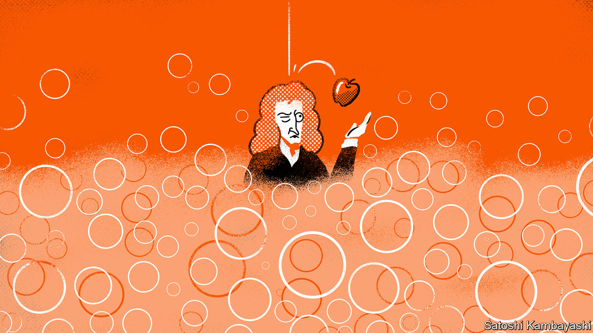

## Buttonwood

# Bubble-hunting has become more art than science

> With the usual gauges of frothiness out of action, behavioural signals are all investors have

> Aug 19th 2020

UPON BEING sucked into investing during the South Sea Bubble, Sir Isaac Newton reflected that he could “calculate the motions of the heavenly bodies but not the madness of people”. From tulip mania in 17th-century Amsterdam to railway fever in Victorian Britain, history is littered with tales of investors who lost their heads shortly before they lost their shirts, in the grip of mass delusions described by Alan Greenspan, a former chairman of the Federal Reserve, as “irrational exuberance”.

These delusions seem obvious with the cold clarity of hindsight. Spotting them in real time, however, is trickier—especially when the usual measures of frothiness are out of action. Wall Street types typically pore over price-to-earnings ratios, which compare a firm’s value with its profits, or free-cashflow measures, which look at the cash firms crank out after investment. Warren Buffett targets firms with a high return on capital, which compares their profits with the size of their balance-sheets. But the covid-induced economic slump has caused earnings to sink even as the Fed and other policymakers have helped buoy share prices. The obvious gauges of frothiness are not much use.

This poses a problem for investors confronting the startling fact that the S&P 500, a share-price index of America’s biggest public companies, reached an all-time high on August 18th in the middle of perhaps the sharpest ever economic downturn. Without hard numbers to count on, they must interpret the market’s unusual behavioural signals in order to spot the froth.

One such sign is the mystifying moves in some stocks. On August 19th Apple became the first American company to touch a valuation of $2trn. Tesla, a carmaker that is undertaking a stock split at the end of August, has quadrupled in value so far this year. It is now worth $354bn, more than Ford, Toyota and Volkswagen combined. Nikola, an electric-truck firm (that has yet to make any lorries), has tripled in value since May. Even more perplexing was investors’ fondness for Hertz, a car-rental firm. Its share price rose tenfold after it declared bankruptcy (though this bubble has since popped).

Anecdotally at least, this frothiness seems linked to a second phenomenon: a zeal for retail investing. Take, for instance, the popularity of Robinhood, a trading platform, which has opened 3m accounts since the end of 2019, taking its users to 13m. Or consider “r/wallstreetbets”, a forum on Reddit, which encourages its readers to make “YOLO” (you only live once) bets on short-dated speculative options (akin to lottery tickets) in order to earn “tendies” (short-term gains). The number of subscribers to it has nearly doubled since January to over 1.4m, edging out its staid cousin, “r/investing”, which preaches the virtues of punting on diversified baskets of low-cost index funds.

That exuberance has been matched by a third behavioural oddity: companies’ enthusiasm for issuance. Dealogic, a data provider, finds that stock issuance in America has jumped by 85% year-on-year so far in 2020. Part of that may be a result of the pandemic; many companies have raised capital to build up war-chests. But issuance is also compelling in bubblier times, because it allows firms to capitalise on lofty valuations. Hertz tried to raise up to $1bn in new equity after it had filed for bankruptcy, before regulators intervened.

Moreover, after a hiatus in the first half of the year, tech firms are rushing to list. Special-purpose acquisition companies (SPACs)—listed shell companies that then merge with private firms, offering a speedy, back-door route to going public—are all the rage. SPACs were once a dirty word on Wall Street, thought fit only for firms unworthy of an initial public offering. But now they are in favour with firms and investors. They have raised $12bn so far this year, just shy of the amount raised in all of 2019.

What to do, in the face of all this enthusiasm? Other assets may start to seem more alluring. On August 14th Berkshire Hathaway, Mr Buffett’s investment firm, said that it had sold chunks of its stakes in banks and bought up shares in Barrick Gold, a mining company. But gold and other assets have also shot up in value this summer.

As markets rise further it may become even harder to resist joining the fray. Some investors may pile in, and exit with a profit. But even the most brilliant minds can be bamboozled. Sir Isaac spotted the bubble early and liquidated his holdings—only to be sucked back in at the very peak.

## URL

https://www.economist.com/finance-and-economics/2020/08/19/bubble-hunting-has-become-more-art-than-science
