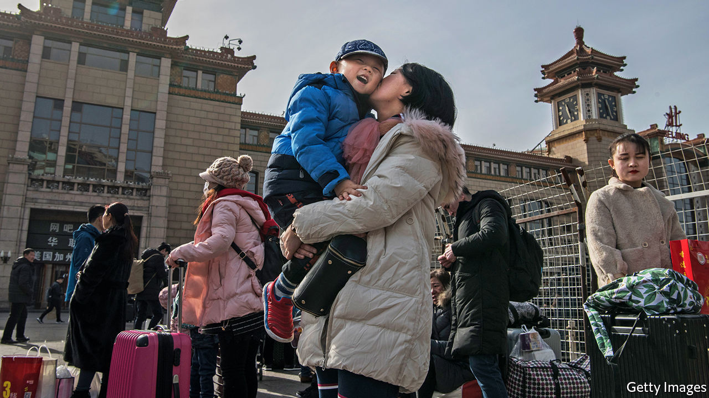

## Matronymics

# More Chinese children are being given their mother’s surname

> It’s not just about feminism

> Aug 29th 2020BEIJING

AS CHINA EMERGED from lockdown, a woman wrote a post on Weibo, a microblog, that has echoed through the long, hot summer. She was divorcing her husband, she said, because he would not allow her to change the surname of her child to her own. Details of the case were scant, but that did not stop it lighting up the internet, shining a new spotlight on the question of how far Chinese women have come. Phoenix Weekly, a magazine, launched an online poll that drew 47,000 respondents. Almost two-thirds said that a surname could come from either parent.

As in most traditional societies, Chinese parents have long preferred sons, and the usual practice of handing down the father’s surname remains a powerful symbol of that (though women have always retained their surname at marriage). But with social mores changing rapidly, more parents have started to give babies the mother’s surname, especially in wealthy urban areas. A paper last month in the Journal of Population Economics found that Chinese children with young, educated mothers from areas with normal sex ratios at birth were more likely than average to be given her surname, and such offspring were healthier and better educated than average. Almost one in ten newborns in Shanghai were given their mother’s name in 2018.

Some young couples have compromised and use both surnames in combination, somewhat like Westerners creating double-barrelled surnames (though only one of those names can be legally recognised in China). According to a survey in 2019, the surnames of more than 1.1m Chinese people now form such a combination, a ten-fold increase on 1990.

Government support for matronymics has been around since the mid-1990s. Giving the mother’s surname to offspring was encouraged within the one-child policy (which was relaxed in 2016), to persuade people to be content with an only daughter. To win them over, officials dug up Chinese texts about ancient matrilineal societies.

Some wonder, however, whether all of this is more to do with genealogy than with feminism. Qi Xiaoying of the Australian Catholic University says that grandfathers are urging their daughters to give their surname to one of their grandchildren now that families can have more than one, because it assures the continuation of the grandparents’ line. Ms Qi calls this “veiled patriarchy”. In-laws now fight over whose name will go to the son. She says matronymics are more popular in Chinese cities not because of an assertion of women’s rights, but because a generation of maternal grandparents has more wealth to hand down, especially if they are richer than their son-in-law’s parents.

At least the trend shows that a patronymic is not a foregone conclusion, says Ms Qi. A survey in 2017 in the south-eastern city of Xiamen found that 23% of second children in two-child families were given their mother’s surname. A couple in the city of Nanjing, surnamed An and Hui, called their children An Zihui and Hui Zi’an, both meaning “the offspring of An and Hui”. “Genealogy and feminism had nothing to do with it,” says Ms Hui. “It was just a way to show our love.”■

## URL

https://www.economist.com/china/2020/08/29/more-chinese-children-are-being-given-their-mothers-surname
