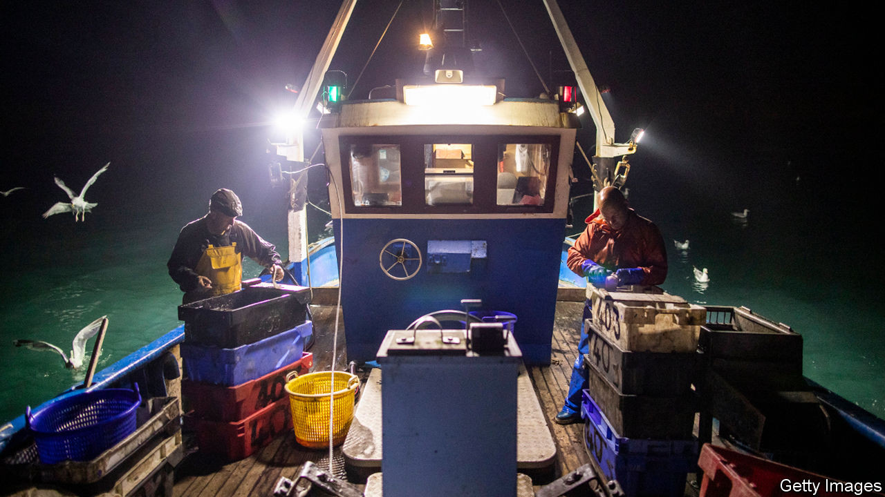

## Brexit

# Fears grow of a December Brexit without a trade deal

> The French will be the toughest negotiators

> Sep 5th 2020

ON JUNE 15th Boris Johnson promised to put “a bit of oomph” into trade talks between Britain and the European Union so as to reach an outline agreement in July. Yet September has come with no sign of a deal. Little progress is expected when the talks resume in London next week. Indeed, Michel Barnier, the EU’s chief negotiator, says negotiations are going backwards and a deal by year-end (when the standstill transition period ends) seems unlikely. The end-October deadline, to allow time to draft and ratify a treaty that will run to hundreds of pages, is just eight weeks away.

This does not make no deal inevitable. Brinkmanship on both sides is often for domestic consumption. Progress has been nugatory because the sticking points are political and cannot be resolved within current negotiating mandates. This applies especially to the two hottest issues—fisheries and rules to stop one side using state subsidies to undercut the other. Heads of government have not engaged in the detail; since they want a deal, many analysts expect a last-minute agreement when they do. After all, this happened last year when Mr Johnson signed the withdrawal treaty.

Yet this may be optimistic. Fisheries, which account for less than 0.1% of GDP, might not scupper a deal, but rules to limit state aid go to the heart of the new relationship. Mr Johnson is allergic to EU constraints on his freedom of action, and his government has not set out its plans for state subsidies. For its part, the EU detects an existential threat in opening up to an untrammelled and competitive neighbour. Never mind that Britain has in the past resorted to state aid less than most countries, or that EU rules against it have been suspended during covid-19.

As Sam Lowe of the Centre for European Reform, a think-tank, notes, the economic difference between a barebones trade deal and no deal is not all that large. A deal would avoid tariffs in sensitive sectors like cars, but in either case disruption from customs checks, lorry queues and intrusive non-tariff barriers would be substantial. The biggest difference might be that, under no deal, Mr Johnson’s team could try to blame disruption not on the deal it had done but on the EU’s obstinacy.

Some argue that Mr Johnson’s growing reputation for incompetence makes him more likely to accept any trade agreement he can get. If he cannot secure the “oven-ready” Brexit deal he promised last year, what can he do? Yet a weakened prime minister who is again seen to be giving in to Brussels bullies would also be vulnerable to attacks from his own party hardliners. Many now claim to be unhappy with the withdrawal treaty, especially the customs border it is erecting between Northern Ireland and Great Britain.

The parallel with Mr Johnson’s last-minute deal with Leo Varadkar, the Irish taoiseach, on the withdrawal agreement in October 2019 does not really work. The timetable is tighter this time. Rejigging the Northern Irish piece of the withdrawal treaty was simpler and quicker than writing a new trade agreement. Last year, unlike today, Mr Johnson was prevented by Parliament from going for the alternative of no deal. And as Georgina Wright of the Institute for Government, another think-tank, says, both sides are now better prepared for the consequences.

Moreover, instead of the friendly Irish in 2019 Mr Johnson now faces the implacable French. They have the most to lose from reduced access to British fishing waters, and are also the most exercised about state aid. Bilateral relations have been strained by rows over asylum-seekers crossing the Channel and covid-19 quarantine rules. Emmanuel Macron faces a tight presidential race in early 2022; being seen to help Mr Johnson would hardly boost his cause. This week his foreign minister, Jean-Yves Le Drian, accused Britain of taking an intransigent and unrealistic attitude.

The talks are likely to go to the wire. Mujtaba Rahman of the Eurasia Group, a consultancy, says that officials are resigned to them drifting into November or even later, assuming a way can be found to avert a cliff-edge crash on December 31st. The currency markets seem relaxed. Yet they may underprice the risk of no deal, which would be hard to pull back from. The bigger paradox is the sight of a supposedly radical Tory government driven not by the urge for post-Brexit deregulation but by an atavistic fondness for 1970s-style state support for industry: a model that looks rather more like China than Singapore.■

## URL

https://www.economist.com/britain/2020/09/05/fears-grow-of-a-december-brexit-without-a-trade-deal
