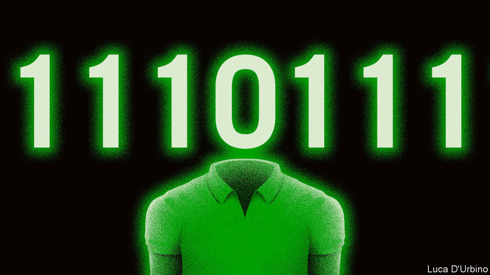

## Time for proof

# Covid-19 strengthens the case for digital ID cards

> With safeguards for privacy and security, they make government work better

> Sep 5th 2020

Editor’s note: Some of our covid-19 coverage is free for readers of The Economist Today, our daily [newsletter](https://www.economist.com/https://my.economist.com/user#newsletter). For more stories and our pandemic tracker, see our [hub](https://www.economist.com//news/2020/03/11/the-economists-coverage-of-the-coronavirus)

THE PANDEMIC has had few silver linings. One is that a huge range of human activities have moved online far more smoothly than almost anyone expected. Businesses have let their white-collar staff work from home for half a year now. People are attending yoga classes remotely. Brits are appearing in court digitally; New Yorkers are tying the knot online.

Yet as they migrate to the virtual world, many people are discovering that they do not have the right documents to prove their identity. Businesses use credit cards, in effect, as a rough-and-ready proof that people are who they say. Governments cannot do that. Rather than simply exchanging goods for money, they give money away and issue commands, so they need to know more about their “customers” than, say, a supermarket does. In countries without a system of secure digital identities, the closure of bricks-and-mortar government offices and the shift of public services online have caused havoc (see [article](https://www.economist.com//international/2020/09/01/covid-19-is-spurring-the-digitisation-of-government)). Divorces and adoptions have run into a virtual brick wall. Italy’s system for doling out emergency payments crashed and then demanded paperwork that applicants could not obtain because government offices were shut. In America, Washington state paid $650m in unemployment insurance to fraudsters who made applications using stolen identities.

No such havoc occurred in Estonia, a tiny Baltic state where every citizen has an electronic identity. More than just an identity card, it links every Estonian’s records together. So when the government created a furlough system for workers affected by the pandemic, it already knew where they worked and how to pay them. Nobody in Estonia had to join a queue on a pavement to claim benefits, as people in other places did.

Other countries, such as Britain and America, have long resisted introducing a national identity system. Some fear that it would make it too easy for the government to spy on people, or would be too easy to hack, or would simply be botched by incompetent bureaucrats. Feelings run high. Boris Johnson, Britain’s prime minister, once vowed that if he had to carry an ID card and a bossy official demanded to see it, he would “physically eat it”.

However, the pandemic has strengthened the case for a digital ID. It would not only make it quicker and easier to access government services remotely. It would also make track-and-trace systems more effective. If, in an emergency such as the pandemic, health data were linked to work data, governments could quickly spot when a cluster of covid patients all happened to work at the same factory.

Worries about privacy and security can be allayed, albeit imperfectly. Estonians, who learned a healthy suspicion of Big Brother during five decades under the Soviet boot, are broadly reassured by a data-protection law and continually updated anti-hacking safeguards that include two-factor authentication. Similarly, laws can be passed to stop police from demanding to see people’s ID cards. Autocratic regimes will abuse ID systems, of course, but democratic governments can be constrained. Estonia’s system records every time a piece of data is viewed, and it is a crime for anyone, including officials, to access private information without good cause. That is a good model.

Creating a digital ID system is hard and expensive. Yet India, a gigantic and largely poor country, has managed it. Its “Aadhaar” biometric system has created digital identities for 1.3bn people. It has flaws: many Indians who were unable to register have suffered gravely from not being able to access services. But it has streamlined government services and massively reduced fraud. If rural Indians can prove who they are online, it is scandalous that many Brits and Americans cannot.

Digital ID systems can be introduced gradually, building on pre-existing platforms. They do not have to be compulsory. If they are reasonably safe and reduce the hassle of dealing with the state, people will willingly sign up for them.■

## URL

https://www.economist.com/leaders/2020/09/05/covid-19-strengthens-the-case-for-digital-id-cards
