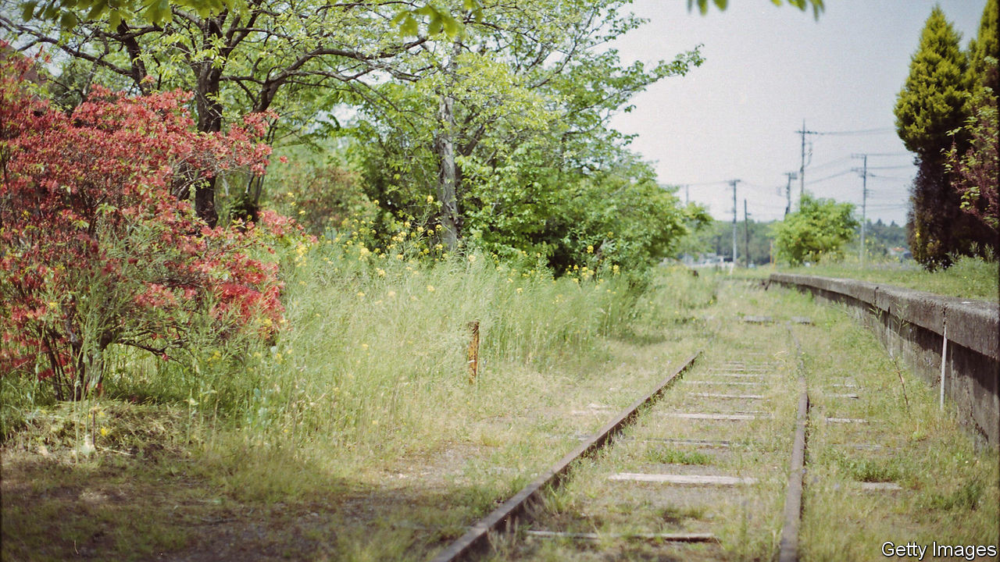

## Undo the locomotion

# Japan’s rural railways are disappearing

> But Tokyo’s rail network is still expanding

> Sep 12th 2020ONAN, SHIMANE PREFECTURE

TUCKED AWAY in the verdant mountains of Shimane, in western Japan, Gobira railway station has nearly disappeared. Its signs have faded, the letters hardly legible. The tracks are blanketed in thick moss and overgrown with weeds. Its last departure was in the spring of 2018, when the 108km-long Sanko Line, which snaked through six municipalities in Shimane and Hiroshima prefectures, closed after 88 years. “It’s sad that the Sanko Line is gone,” a local reminisces. “When we were young, we would stretch our hands out of the train windows and touch the leaves of the mountain.”

The line carried an average of 83 passengers a kilometre in 2016, down from 458 in 1987. It was losing ¥900m ($8.5m) a year when it shut. “It was a difficult decision,” says Masuda Kazutoshi, a former mayor of one of the towns served, who oversaw the process. “But in reality, we all knew that this was going to happen.” A bus service has replaced the trains.

Japan is a railway powerhouse. The famed shinkansen, or bullet trains, connect far-flung corners of the country. Two new stations were added this year to Tokyo’s already expansive commuter-rail network to ease congestion at rush hour and provide better access to venues for the Olympics. One of the new stations boasts cleaning robots and an automated convenience store.

Yet many railways in rural areas face a similar fate to the Sanko Line. A total of 44 lines, spanning over 1,000km, have closed since 2000. Three-quarters of local railway companies are unprofitable. The shrinking and ageing of the population, which are especially acute in rural areas, have drained away passengers and revenue. Cars have also become more popular in rural areas, even among the elderly: the number of licence-holders over the age of 75 is climbing, according to government statistics. Covid-19, which has slashed the number of workers and tourists on rural routes, will push railways further into debt.

The government provides relatively little support for struggling lines. Japan’s railways were privatised in the late 1980s, and the subsidies train companies receive are at best a quarter of what is needed to keep them all afloat, estimates Utsunomiya Kiyohito of Kansai University. Roads, by contrast, receive massive funding. Near the defunct Gobira station, dozens of construction workers can be seen toiling on road-improvement schemes.

“Lawmakers living in Tokyo don’t see what’s happening in rural communities,” laments Kojima Mitsunobu, chairman of Ryobi Holdings, a transport company. Resentment of rural-urban disparities runs deep in the municipalities of Shimane and Hiroshima, too. “Japan thinks Tokyo is the only place people live in,” says Morita Ippei of Gounokawa Railway, an organisation seeking to revitalise the towns along the Sanko Line. “The Sanko Line disappeared. We were abandoned, discarded.”

“If we continue down this path, every form of public transport in rural regions will disappear in the future,” warns Mr Utsunomiya. The buses that replaced Gobira’s trains are empty: “carrying air”, as Mr Masuda puts it. He worries it is not so much public transport that is disappearing, but rather the communities it serves. ■

## URL

https://www.economist.com/asia/2020/09/12/japans-rural-railways-are-disappearing
