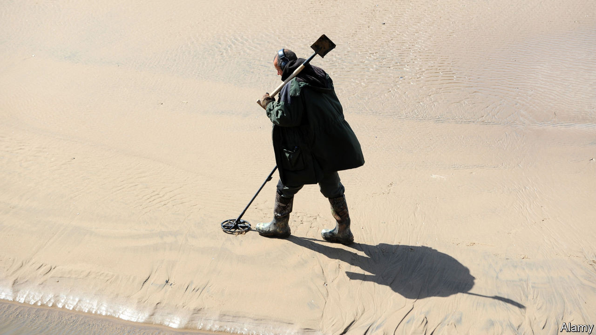

## Gold diggers

# Britain’s treasure-hunting hobbyists get professional

> But only on their own terms

> Sep 10th 2020

IN A FIELD next to his local pub, Luke Mahoney found a gold coin and a sixpence piece, before heading off for a bite to eat. After lunch, the businessman, who runs a firm selling metal detectors, discovered that a plough had cracked open a pot two feet down. His detector went mad. That afternoon he unearthed 1,080 silver coins, possibly dating back to the civil war, which he thinks could be worth £400,000 ($520,000): “Christ, we literally skipped across the field from the pub, and found 400 grand!”

Lockdown and the furlough scheme have given detectorists even more free time to forage. They have unearthed neolithic arrowheads and ancient coins in their back gardens. In June, a detectorist in Scotland happened upon a complete Bronze Age horse harness and a sword still in its scabbard, with the metal and wood preserved by the soil. Another enthusiast discovered a 467-year-old coin thought to be worth around £15,000.

England provides fertile terrain for detectorists. Under the Treasure Act, diggers must report findings within a fortnight, give museums first refusal on items and split any cash made with landowners, at a rate set by independent experts. But that is still more generous than elsewhere. In Scotland the government takes a share. Parts of the Netherlands made the hobby legal only four years ago. Other countries require licences. Partly as a result of the government’s relaxed regulation, business is booming. According to official figures, last year detectorists found 1,311 objects, up from 1,005 in 2015.

This has prompted the establishment to take notice. Detectorists have tended to have a fraught relationship with scholarly archaeologists. Ian Richardson, the British Museum’s senior treasure registrar, says he worries that amateurs tamper with history by removing artefacts from sites without properly recording them. Last year two detectorists were jailed for stealing 300 Viking coins and other goodies from a Herefordshire field. English Heritage, a charity, has invested £50,000 in a new metal-detecting training body to prod detectorists in the right direction. “There’s a recognition that if people practise metal detecting responsibly, then it can make a useful contribution to the archaeological record,” says Mr Richardson.

Detectorists see attempts to professionalise them as patronising nonsense. Many believe training to be a form of covert licensing. “They’re saying that you have to be trained by these so-called ‘experts’,” says one. “Well these so-called ‘experts’ have been out of university for ten minutes.” Detectorists claim archaeologists often misidentify their finds, causing havoc when they come up for sale.

Instead, they prefer to focus on self-improvement. Some detectorists now live-stream excavations, so newbies can pick up tips. Firms like Joan Allen Metal Detectors, which is run by Mr Mahoney, have started to organise ticketed events, where metal detectorists gather at carefully chosen sites of historical interest.

Mr Mahoney now wants to take this a step further. Buoyed by his recent success, he is putting together a crack team of detectorists. They have been using their skills to help other hobbyists who think they have stumbled across hoards. “My good god, it is staggering how much wealth of history is yet to be uncovered,” Mr Mahoney enthuses. “It’s insane and no one’s talking about it.” ■

## URL

https://www.economist.com/britain/2020/09/10/britains-treasure-hunting-hobbyists-get-professional
