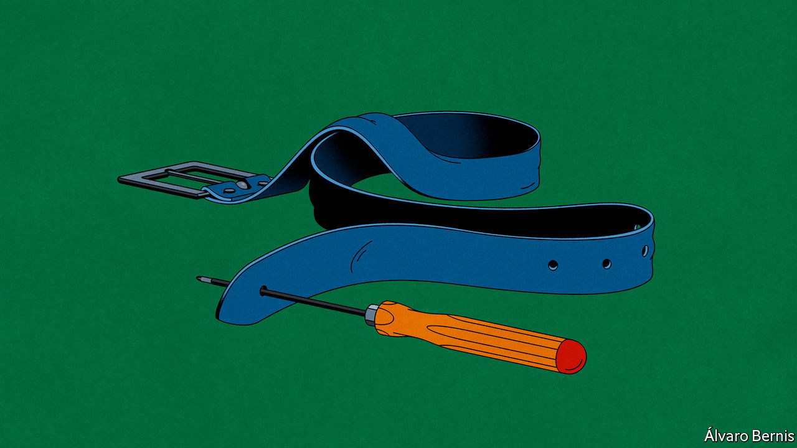
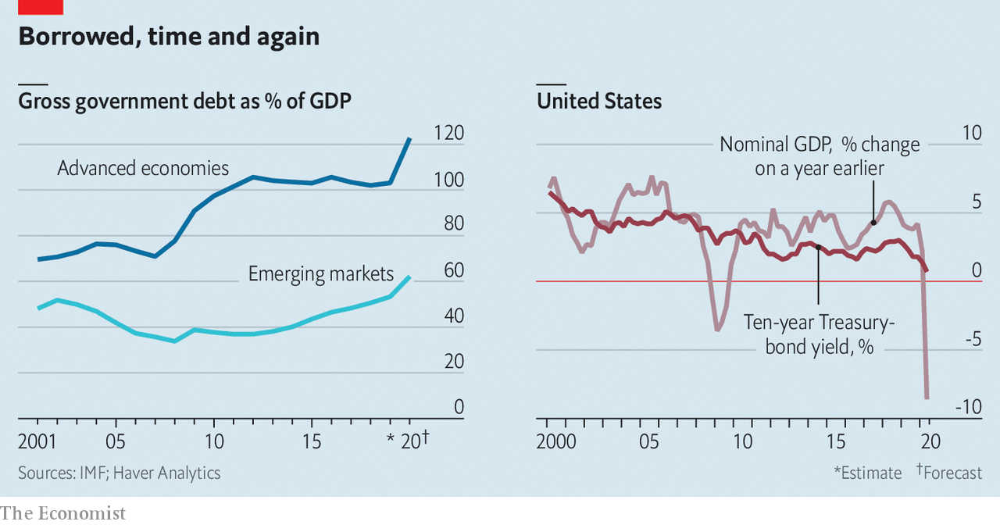

## Putting on weight

# Governments can borrow more than was once believed

> Hence only muted concern about borrowing to respond to covid-19

> Sep 12th 2020

IF PEOPLE KNOW one thing about the thinking of John Maynard Keynes, who more or less founded macroeconomics, it is that he was in favour of governments borrowing lots of money, at least under some circumstances. The “New Keynesian” orthodoxy that evolved from his work in the second half of the 20th century was much less liberal in this regard. It put less faith in borrowing’s purported benefits, and had greater concerns about its dangers.

The 2010s saw the pendulum swinging back. In large part because they feel bereft of other options, many governments have borrowed heavily—and as yet they have paid no dreadful price. Can this go on?

Keynes’s ideas about borrowing reflected his view of recessions—and in particular, the Depression of the 1930s, during which he wrote “The General Theory of Employment, Interest and Money”—as vicious circles. Recessions come about when the economy is hit by a sudden rise in the desire to save money; such desires lead to lower spending, which leads to more unemployment, which leads to yet less spending, and so on. If the government borrows enough to offset lower private spending with increased spending of its own the circle can be broken—or stopped from getting going.

Most early Keynesians assumed that the deficits caused by borrowing to stimulate the economy would be temporary; after borrowing more than they raised in taxes in order to provide a fiscal stimulus, governments would be able to raise more in taxes, and thus pay off their debts, in the good times that followed. Some, though, suspected that the structure of the advanced economies of the 1930s might mean they were low on demand even in the good times, and that a permanent deficit might be necessary to keep the economy going at a rate that minimised unemployment.

Debates about the proper role of fiscal stimulus became less urgent in the decades after the second world war, as robust economic growth eased worries that demobilisation might bring a return of Depression-like conditions. Faith in Keynesian orthodoxy was further shaken by the economic developments of the 1970s and 1980s. Some economists began to argue that the public would eventually adjust to stimulus measures in ways that weakened their impact. Robert Barro, a leading proponent of this “rational expectations” approach, argued that a fiscal stimulus paid for by borrowing would see households spend less and save more, because they would know that tax rises were coming. This decreased private spending would then offset the increased public spending.

Linked to, but broader than, such academic questions was the fact that, by the 1970s, the ways in which Keynesian governments had been running their economies seemed to have failed. A trifecta of slowing growth, soaring inflation and high unemployment brought the idea of governments being able to avoid recessions through stimulus into disrepute.

The new orthodoxy was that governments should instead rely on monetary policy. When the economy slowed, monetary policy would loosen, making it cheaper to borrow, thus encouraging people to spend. Government borrowing, for its part, should be kept on a short leash. If governments pushed up their debt-to-GDP ratio, markets would become unwilling to lend to them, forcing up interest rates willy-nilly. The usefulness of monetary policy demanded a sober approach to fiscal policy.

The 2000s, however, saw a problem with this approach beginning to become plain. From the 1980s, interest rates had been in a long, steady decline. By the 2000s they had reached historical lows. Low rates made it harder for central banks to stimulate economies by cutting them further: there was not room to do so. The global financial crisis pushed rates around the world to near zero.

Governments experimented with more radical monetary policy, such as the form of money printing known as “quantitative easing”. Their economies continued to underperform. There seemed to be room for new thinking, and a revamped Keynesianism sought to provide it. In 2012 Larry Summers, a former American treasury secretary, and Brad DeLong, an economist, suggested a large Keynesian stimulus based on borrowing. Thanks to low interest rates, the gains it would provide by boosting the growth rate of GDP might outstrip the cost of financing the debt taken on.

In the following year Mr Summers followed some 1930s Keynesians, notably Alvin Hansen, in suggesting that borrowing in order to stimulate might be needed not just as an occasional pick-me-up, but as a permanent part of the economy. Hansen had argued that an ageing population and a low rate of technological innovation produced a long-term lack of demand which he called “secular stagnation”. Mr Summers took an updated but similar view. Part of his backing for this idea was that the long-term decline of interest rates showed a persistent lack of demand.

Sceptics insisted that such borrowing would drive interest rates up. But as the years went by and interest rates remained stubbornly low, the notion of borrowing for fiscal stimulus started to seem more tenable, even attractive. Very low interest rates mean that economies can grow faster than debt repayments do. Negative interest rates, which have been seen in some countries over recent years, mean that the amount to repay will actually be less than the amount borrowed.

Adherents of “Modern Monetary Theory” (MMT) went further than this, arguing that governments should borrow as much as was needed to achieve full employment while central banks focused simply on keeping interest rates low—a course of action which orthodox economics would expect to promptly drive up inflation. Currently MMT remains on the fringes of academic economics. But it has been embraced by some left-wing politicians; Senator Bernie Sanders, the candidate beaten by Joe Biden for the Democratic nomination, counted an MMT enthusiast, Stephanie Kelton of Stony Brook University, among his chief advisers.

The shift in mainstream thinking on debt helps explain why the huge amounts of government borrowing with which the world has responded to the pandemic has not worried economists. But now that governments have, if only for want of an alternative, become more willing to take on debt, what should be their limit? For an empirical answer, it is tempting to consider Japan, where the ratio of net public debt to GDP stood at 154% prior to the pandemic.

If Japan can continue to borrow with that level of debt, it might seem that countries with lower levels should also be fine. But this ignores the fact that if interest rates stagger back from the floor, burdens a lot smaller than Japan’s might become perilously unstable. There is no immediate account for why this might be likely. But that does not mean it will not happen. And governments need to remember that debt taken on at one interest rate may, if market sentiment changes, need to be rolled over at a much higher one in times to come.

Given this background risk, governments ideally ought to make sure that new borrowing is doing things that will provide a lasting good, greater than the final cost of the borrowing. If money is very cheap and likely to remain so, this will look like a fairly low bar. But there are opportunity costs to consider. If private borrowing has a high return and public borrowing crowds it out, then the public borrowing either needs to show a similarly high return or it needs to be cut back.

At the moment private returns remain well above the cost of new borrowing in most places: in America, for instance, the earnings of corporations are generally high relative to the replacement cost of their capital. This makes it conceivable that resources used by the government would generate a greater level of welfare if they were instead mobilised by private firms.

But it does not currently look as though they would be. Despite the seemingly high returns to new capital, private investment in America is quite low. This suggests either that there are other obstacles to new investment, or that the high returns on investment reflect an insufficient level of competition rather than highly productive companies.

Both possibilities call for government remedy: either action aimed at identifying and dismantling the obstacles to investment, or at increasing competition. And until such actions produce greater investment or lower returns, the case for government borrowing remains quite strong. This is even more the case for public investments which might in themselves encourage the private sector to match them—“crowding in”, as opposed to crowding out. Investment in a much better electricity grid, for example, could increase investment in zero-carbon generation.

In the long run, the way to avoid having to borrow to the hilt is to implement structural changes which will revive what does seem to be chronically weak demand. Unfortunately, there is no consensus over why demand is weak. Is technological progress, outside the realm of computers and communications, not what it was? Is inequality putting money into the hands of the rich, who are less likely to spend their next dollar, rather than the poor, who are more likely? Are volatile financial markets encouraging precautionary saving both by firms and governments? Is the ageing of the population at the root of it all?

Making people younger is not a viable policy option. But the volatility of markets might be addressed by regulation, and a lack of competition by antitrust actions. If inequality is at the root, redistribution (or its jargony cousin, predistribution) could perk up demand. Dealing with the structural problems constraining demand would probably push up interest rates, creating difficulties for those governments which have already accumulated large debt piles. But stronger underlying growth would subsequently reduce the need for further government borrowing, raise GDP and boost tax revenues. In principle that would make it easier for governments in such situations to pay down their increased debt.

The new consensus that government borrowing and spending is indeed an important part of stabilising an economy, and that interest rates are generally low enough to allow governments to manage this task at minimal cost, represents progress. Government borrowing is badly needed to deal with many of the world’s current woes. But this consensus should ideally include two additional planks: that the quality of deficit-spending still matters, and that governments should prepare for the possibility of an eventual change in the global interest-rate environment—much as 2020 has shown that you should prepare for any low-probability disaster. ■

## URL

https://www.economist.com/schools-brief/2020/09/12/governments-can-borrow-more-than-was-once-believed
