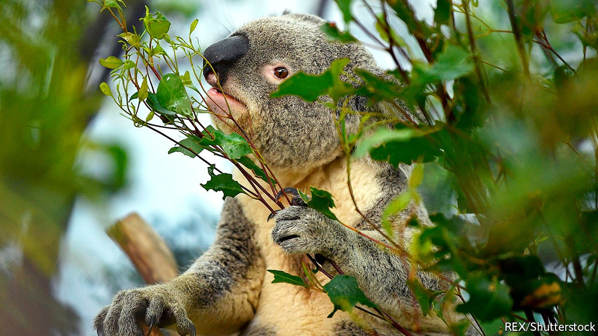

## Koalition politics

# Koalas almost bring down an Australian state government

> The disagreement does not bode well for the country’s oldest political alliance

> Sep 19th 2020SYDNEY

EVERYONE LIKES koalas. Lots of people worry about their dwindling numbers. When fires tore along Australia’s east coast last summer, some humans risked their lives to rescue them. Strange, then, that a dispute about their conservation almost blew up a harmonious coalition government in New South Wales.

Its two contingents, the Liberals and the Nationals, have governed in a conservative partnership for generations. This falling out was triggered by an obscure policy which makes it somewhat harder for landowners to cut down trees in which koalas might live. The rules came into force months ago and greens view them as far too weak. But to the Nationals, who represent farmers, they are “the epitome of overbearing bureaucracy”.

On September 10th their leader in the state, John Barilaro, announced that his MPs would stop voting with the state government until the policy was pared back. That would have left the Liberals in the minority in the state assembly. The mutiny crumbled when the premier, Gladys Berejiklian, threatened to strip the Nationals of their ministries. But the underlying problems persist.

As a pair, the Liberals and Nationals win more elections than the opposition Labor party. But support for the Nationals is waning. Their rural strongholds are scorched by drought and compete with one another for water from near-dry rivers. Many supporters feel ignored. Populists have exploited these frustrations for years. The latest threat comes from the prosaically named Shooters, Fishers and Farmers Party.

Mr Barilaro’s answer is to shout more loudly that “we cannot allow city-centric politics to dictate our way of life in the bush”. Rural Australians have never liked being preached to about the evils of felling trees and the like. But concerns about such things are growing in more populated, suburban Liberal-voting areas. Neither side can win elections alone. But it is getting harder, says Paul Williams of Griffith University, “to maintain the façade of a happy marriage”.

## URL

https://www.economist.com/asia/2020/09/19/koalas-almost-bring-down-an-australian-state-government
