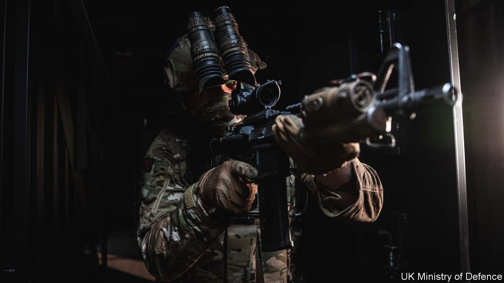

## Into the greyzone

# Britain’s armed forces get ready for a revolution

> The emphasis is on threats short of open warfare and the technological prowess to combat them

> Sep 15th 2020RAF WYTON

THE CAVERNOUS space inside RAF Wyton, an airbase near Cambridge, resembles a newsroom. But the stories traded here are heavily classified. The Defence Intelligence Fusion Centre is the world’s only hub where personnel from across the Five Eyes alliance (comprising America, Australia, Britain, Canada and New Zealand) keep a watch on the world’s hotspots. The logo of GCHQ, Britain’s signals-intelligence agency, hangs above one desk. That of America’s Defence Intelligence Agency above another. In a crisis, 1,200 people could fit around the open-plan desks; during a pandemic, things are roomier.

The British government is nearing the end of an “integrated review”, a sweeping reassessment of defence policy that will also consider the country’s foreign, security and aid policies. The starting-point for that effort is the threat that Britain faces. And the intelligence flooding into Wyton from submarines, satellites, human sources and open sources paints a different picture from the one seen in the past, explains Lieutenant-General Jim Hockenhull, the chief of defence intelligence.

The first issue is fancier weapons. He points to Russia’s deep-water submarines, nuclear-armed underwater drones and anti-satellite projectiles. “Russia”, he says, “is pushing the boundaries of science, and international treaties.” Advanced weapons once held only by a clutch of states, such as precision-guided missiles, are in the hands of smaller powers and non-state groups.

A second trend is the rise of new threats. Though Russia is ranked as the biggest military threat to Europe, China is a growing problem. “China poses the greatest threat to world order,” says General Hockenhull, “seeking to impose Chinese standards and norms and using its economic power to influence and subvert.” It would have been unthinkable for a British official to use such language about China a few years ago, but the government’s decision in July to ban Huawei from British 5G mobile networks reflects a hardening stance.

Britain sits at a safe distance from China, but anti-satellite weapons, cyber-attacks and AI-enabled propaganda pay no heed to geography. China’s navy, the world’s largest, is increasingly making forays into European waters. When HMS Queen Elizabeth, an aircraft-carrier, sails for Asia next year, it will head towards waters patrolled by Chinese vessels including the Renhai-class warships that General Hockenhull describes as “the most capable” destroyers of any navy. Chinese weapons, he adds, are “fast eroding Western military advantages”.

Counting warships and missiles is the bread-and-butter of defence intelligence. Perhaps the biggest shift in the threat landscape is the change in how war is waged. Britain’s enemies reject the “traditional binary view of peace and war”, instead waging “continual struggle”, says General Hockenhull. Much of that struggle is in what has come to be called a “greyzone”, below the threshold of open conflict.

That includes familiar skulduggery like disinformation and assassination, but it can involve more muscular interventions. Ben Wallace, Britain’s defence secretary, has pointed to the example of the Wagner group, a mercenary force that serves as a deniable arm of Russian power in several warzones.

Responding to greyzone threats is hard. Provocations, like assassination, hardly justify sending in tanks. That can allow enemies to take a salami-slicing approach, sowing fear or nibbling at territory little by little. Most Western armed forces lack the legal authority to jump into a peacetime crisis with guns blazing—or the disregard for ethics to wield weapons like the nerve agent, Novichok.

What does this mean for Britain’s armed forces? On September 14th Mr Wallace and Britain’s chief of defence staff, General Sir Nick Carter, signalled a “significant change in military philosophy”. In place of “mass and mobilisation”, said Mr Wallace, “this future force will be about speed, readiness and resilience, operating much more in the newest domains of space, cyber and sub-sea”. Mr Wallace, who had earlier criticised Britain’s “sentimental attachment to a static, armoured-centric force”, promised that the future force would be “more forward deployed”, popping up around the world.

Paying for all this will require cuts. A reduction in tank numbers and warplane orders seems likely. Will Jessett, who led the Ministry of Defence’s work on the last defence review, in 2015, says that earlier reviews were too cautious in getting rid of “sunset” capabilities. Britain should “carve out a niche where we could make a distinctive contribution,” he reckons. The Royal Marines, for instance, are developing a “future commando force”, including small units permanently deployed around the world. On September 15th the head of the Royal Air Force promised a “game-changing mix of swarming drones, autonomous remotely piloted and piloted aircraft”.

But the emphasis on greyzone threats, technological solutions and niche capabilities is fraught with risk. The more Britain specialises, the more it will have to rely on allies to fill any gaps. David Blagden of the University of Exeter points out that Russia’s invasion of Ukraine, which is often held up as a canonical example of greyzone war, involved several armoured divisions and veiled nuclear threats—hardly something to be countered by commandos, drones and cyber-attacks. Betting on futuristic weapons while retiring proven capabilities is a “high-stakes gamble”, says Mr Blagden. There is also a political angle. Nimbler armed forces tend to be slimmer ones. That may not go down well with Conservative voters who like their taxes low and their navies large. ■

## URL

https://www.economist.com/britain/2020/09/15/britains-armed-forces-get-ready-for-a-revolution
