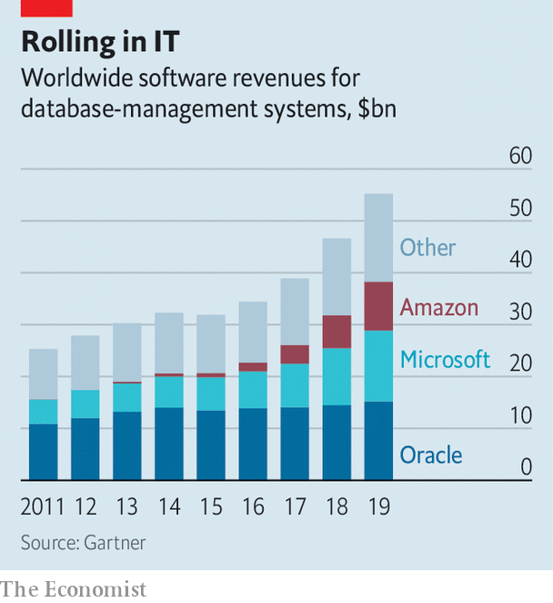

## Steam engine in the cloud

# How Snowflake raised $3bn in a record software IPO

> But competition in the database business is heating up

> Sep 15th 2020SAN FRANCISCO

CATCHING SNOWFLAKES is fun. It has become lucrative, too. Investors scrambled for shares in Snowflake, a maker of database programs, as it went public on the New York Stock Exchange on September 16th. The eight-year-old firm more than doubled its valuation the first day of trading, from $33bn to over $70bn, making its initial public offering the largest ever for a software firm. Even Warren Buffett, abandoning his customary tech-shyness, got in on the action. The legendary investor’s conglomerate, Berkshire Hathaway, put $735m into the firm, through a separate private placement and by purchasing shares from a former chief executive—a stake that is now worth $1.56bn.

The excitement shines a light on an obscure corner of information technology: software for managing corporate data. This database market already generates $55bn a year in sales (see chart). It is expected to expand rapidly as data become, if not the new oil, then at least an input for most companies. And it is changing in intriguing ways—not all of them good for Snowflake.

A database used to be best understood as a digital steam engine. Before electricity came along, a factory’s machines sat near a single power source. Similarly, corporate applications—programs that keep track of a firm’s finances or its supply chain, say—were built around databases housing all of a firm’s important information. Hard disks were pricey and had limited capacity so the best way to store it was in lean “relational” databases. Max Schireson, who used to run MongoDB, a database-maker, and now works for Battery Ventures, an investment firm, likens these to “a parking garage where, to save space, you put all the seats in one place, the tyres in another and so on”. The industry became dominated by a few firms, with Oracle leading the pack.

As storage got cheaper and data volumes exploded, though, startups erecting new kinds of digital car park proliferated. Many focus not on tracking specific transactions but on analysing all manner of data to glean relevant knowledge about a business, such as where certain products sell best. These more cluttered “data warehouses”, as they are known, were pioneered in the late 1970s by a firm called Teradata. Their latest iterations are “data lakes”, which take in all sorts of unstructured information, including text and pictures.

Snowflake has gone a step further. It was one of the first firms to lift database systems from companies’ in-house data centres and into the computing clouds, the biggest of which are operated by Amazon, Google and Microsoft, a trio of tech giants. Snowflake’s customers can add capacity as needed—and pay depending on their use rather than a fixed price for a software licence, as was typical for relational databases. Better yet, its “multi-cloud” service works across the three big computing clouds, so customers need not get locked into any one of them. Recently Snowflake has also added features that let customers share and sell data, setting itself up as a data exchange of sorts.

This has convinced many that Snowflake could be the next Oracle. The firm is certainly on a roll. Although it has yet to make money, its losses, of $171m in the six months to July, have declined as revenue has more than doubled year on year, to $242m. On current trends sales could reach nearly $1bn in the next 12 months.

Despite these promising numbers, and the market’s blessing, Snowflake has its work cut out. The company’s uniqueness will not last much longer, says Donald Feinberg of Gartner, a research firm. Rival firms, in particular the big cloud providers, have been beefing up competing products and have even dabbled with the multi-cloud. A few startups are already offering cheaper and more flexible “open source” alternatives such as ClickHouse, a particularly zippy data-management system sold by a startup called Altinity.

Other challengers are building more specialised digital repositories. Data generated by websites, for instance, are often stored on “document-oriented” databases that, in the garage analogy, keep cars intact rather than strip them for parts. MongoDB is the market leader in this segment. Confluent, another startup, is big in “streaming” databases that garner information from sources like sensors. These are more akin to a motorway service station: data are quickly checked to see if action is needed.

Much as today’s assembly lines are driven by dispersed electric motors rather than a single steam engine, then, corporate IT systems will increasingly rely on sundry specialised databases, predicts Zane Chrane of Bernstein, a broker. That—and the fact that data will increasingly be analysed in real time, rather than saved in a conventional database—will limit the power and profits of any single supplier. So Snowflake is unlikely ever to become as dominant as Oracle. Snowflakes fly high in a flurry. They also melt.■

## URL

https://www.economist.com/business/2020/09/15/how-snowflake-raised-3bn-in-a-record-software-ipo
