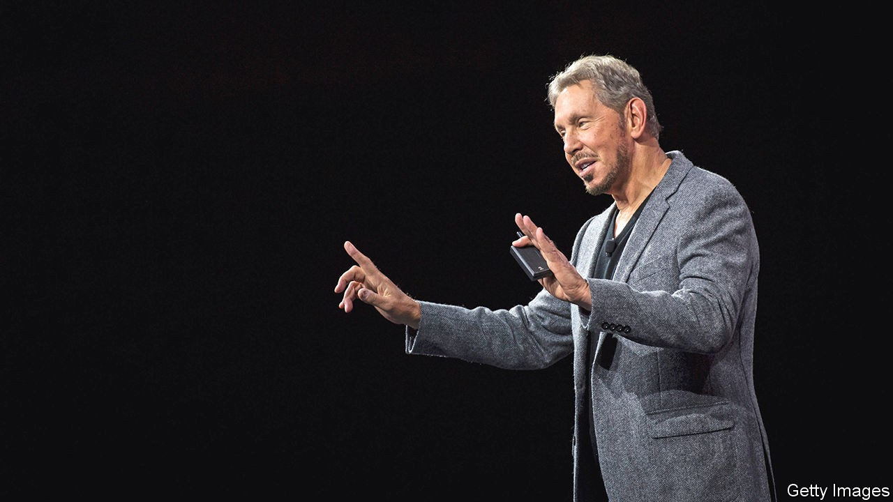

## Oracle’s Trump card

# Who are the TikTok saga’s biggest winners?

> As the race to control TikTok enters the final stretch, a White House-friendly tech giant seems to have carried the day

> Sep 16th 2020

PRESIDENT DONALD TRUMP’S demand in August that ByteDance sell TikTok to an American firm set off a race for the Chinese firm’s trophy asset. Jockeying for the popular short-video app’s American business, with 100m users, was fierce. Microsoft seemed ahead, and got a late fillip when Walmart joined its bid. But the software-and-grocery duo was pipped to the post. On September 14th Oracle, a database firm, signalled it had brokered a deal.

Oracle’s clinching argument in its favour seems to have been its rapport with the White House. Larry Ellison, Oracle’s founder and chairman, hosted a fund-raiser for Mr Trump. The firm’s boss, Safra Catz, served on his transition team in 2016. “She lobbied a lot in Washington and she did a great job,” says a ByteDance investor. Oracle also enlisted the firm’s powerful American venture-capital backers, including Sequoia Capital and General Atlantic.

Details of the planned transaction are still being ironed out. But it looks like a U-turn for Mr Trump, who for months seemed hellbent on a full sale of TikTok by ByteDance—which the Oracle deal is not. His stated reasons concerned national security: the risk of TikTok handing Americans’ data over to China’s Communist Party and of running disinformation campaigns on behalf of China. (TikTok insisted it would never hand users’ data to China and that it has no propaganda role.)

The deal leaves both the president’s supporters and critics of his strong-arming of TikTok scratching their heads. Josh Hawley, a Republican senator from Missouri, called the deal “flatly inconsistent” with Mr Trump’s original executive order, which promised to ban the app unless its ownership changed by September 20th.

Perhaps to help make up for the absence of a clean sale, ByteDance is giving Oracle sway over all of TikTok globally rather than just America, Canada, Australia and New Zealand. Microsoft and Oracle were offering around $25bn-30bn to acquire these four markets. The revised plan is for ByteDance to place global TikTok into a separate company with headquarters in America. ByteDance would remain the majority shareholder. Its American VC investors are expected to come in as minority shareholders alongside Oracle—an arrangement that suits them better than TikTok’s sale to Microsoft, which would have deprived them of meaningful influence over the world’s hottest social-media property.

The Committee on Foreign Investment in the United States (CFIUS), a federal oversight body which has been examining TikTok for months, will assess the transaction by September 20th. It then falls to Mr Trump to give it the formal go-ahead. People close to ByteDance worry that China hawks around him could still derail it.

Chinese majority ownership still rankles. Oracle and ByteDance also have no clear answer to worries about disinformation. And though Oracle will host and process all American data in its computing cloud, and possibly that of TikTok users globally, the deal does not sever TikTok’s links with its Chinese parent. ByteDance will keep supplying, running and updating the algorithm that powers TikTok’s “for you” page. Microsoft argues it would have made a better TikTok steward, for example by continually vetting the algorithm. In an acerbic concession note, the software giant said it will monitor TikTok’s future progress in the areas of “security, privacy, online safety and combating disinformation”.

The fudge may suit Mr Trump fine. Risks associated with banning TikTok have risen. On August 28th China’s commerce ministry invoked its own national-security concerns to block the sale of ByteDance’s algorithm to foreigners. It seemed to dare the president to go for a ban, the legal basis for which has always looked shaky. According to an American diplomat, the executive orders on TikTok were drafted by Peter Navarro, the president’s China-bashing economic adviser. They did not go through the usual vetting process by lawyers and bureaucrats and could contain holes; ByteDance has already filed a lawsuit. Mr Trump’s other advisers also cautioned against a ban that could irk millions of TikTokers in battleground states like Texas and Florida.

The most obvious winner from the farrago is China’s government. Its bureaucrats played the political chess game to perfection, notes a ByteDance investor. The Chinese firm gets to keep some of its prize asset rather than sell it on the cheap. Oracle will benefit, especially if it manages to wrest TikTok’s cloud contract from Google—though the internet giant may challenge such a move in court. Microsoft, which also has a big cloud platform, looks the loser. But given the chaos and uncertainty of dealing with Mr Trump, the runner-up might in time come out ahead. ■

## URL

https://www.economist.com/business/2020/09/16/who-are-the-tiktok-sagas-biggest-winners
