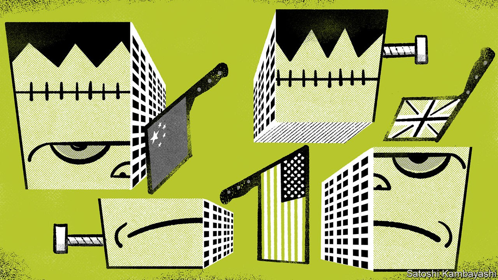

## Corporate contortions

# Will TikTok survive?

> The contortions at TikTok and Arm are an unfortunate sign of things to come

> Sep 19th 2020

ON AUGUST 6TH, when the White House told TikTok that it had 45 days to shut down or find an American buyer, there was a risk that the Chinese-owned video app would disappear from America, infuriating its 100m users there and destroying billions of dollars of investors’ wealth. Now a last-minute fudge seems to have been found. TikTok has said it will enter a complex partnership with Oracle, an American tech giant, that is designed to show it is more under American sway. The day before Nvidia, an American semiconductor company, bid $40bn for Arm Holdings, a British-based chip-design firm, triggering a storm in Britain about how to stop its tech champion from being dragged into America’s trade war. Far from being oddities, the two episodes offer a preview of how the new age of nationalism will change the way multinational firms are run—for the worse.

Both companies straddle geopolitical divides and are at the heart of the digital economy (see [article](https://www.economist.com//node/21791912)). TikTok is owned by ByteDance, a Chinese tech star. The White House says it fears that users’ data are being sent to China, where Big Brother can spy on them, and that the algorithm which selects videos is vulnerable to Chinese manipulation. Arm’s designs are used worldwide, not least in America and China, its two largest markets. Britain’s government worries that a takeover will see key activity shifted abroad (in 2016 Arm was bought by SoftBank, a Japanese firm, which promised to keep the firm’s base in Britain until 2021). A further concern is that, under American ownership, Arm will no longer be a “neutral” supplier, instead becoming an instrument of Uncle Sam’s expanding sanctions regime.

Throughout history companies have adapted to geopolitics. In the freewheeling era of globalisation that began in the 1980s, the idea took hold around the world that all firms should be treated equally, regardless of their nationality. That made it efficient to operate as a global firm with a unitary management, capital structure and system of production. By contrast the 1930s and 1940s were plagued by wars and protectionism. Businesses such as General Motors responded by allowing their foreign operations to become semi-autonomous. Rather than merge, many firms co-operated across borders through alliances and cartels.

The proposed TikTok deal shows how business is heading in a 1930s direction. Although the details are not yet public, the firm’s ownership will probably change, with American shareholders, including Oracle, and possibly Walmart, holding a large minority stake, perhaps with rights to veto some decisions. The location of key assets will shift, with the headquarters moving to America and Oracle managing the data-storage there (and monitoring the algorithm). Arm, meanwhile, has already contorted its structure once to deal with geopolitics: in 2018 it sold a 51% stake in its China operation to mainly Chinese investors, including state-backed funds. Now it may face a new metamorphosis. The British government, for example, may demand further legal guarantees that it is run autonomously in Britain. That would be part of a push to bolster the country’s industrial base, which has triggered a row with the European Union (see [article](https://www.economist.com//node/21791880)).

These corporate contortions have glaring limitations. Politicians get to play God: President Donald Trump seems to favour Oracle—whose chairman, Larry Ellison, is a Trump supporter—rather than a bid by Microsoft, which made slightly more commercial sense. Mr Trump may now demand more concessions, and any deal will also need approval from the newly beefed up investment-screening regimes in America and China. Subdividing businesses into national silos duplicates costs, and complex structures can leave it unclear where control lies. Arm is locked in a bitter dispute with a Chinese executive over who is really in charge of its Chinese joint venture.

Despite this, expect more multinational manoeuvres as globalisation unwinds. Australia’s government is asking for Rio Tinto, a scandal-prone global mining firm, to be run by an Australian. European tech firms may bifurcate, with one production line serving Chinese clients and another American ones. Chinese companies may have to make do with buying minority stakes abroad, not full control. Firms crippled by sanctions—Huawei, say—may dissolve, with their intellectual property and best people migrating to competitors that do not face such constraints. Geopolitics is twisting global business into a form that is less efficient and less free. That is to be lamented.■

## URL

https://www.economist.com/leaders/2020/09/19/will-tiktok-survive
