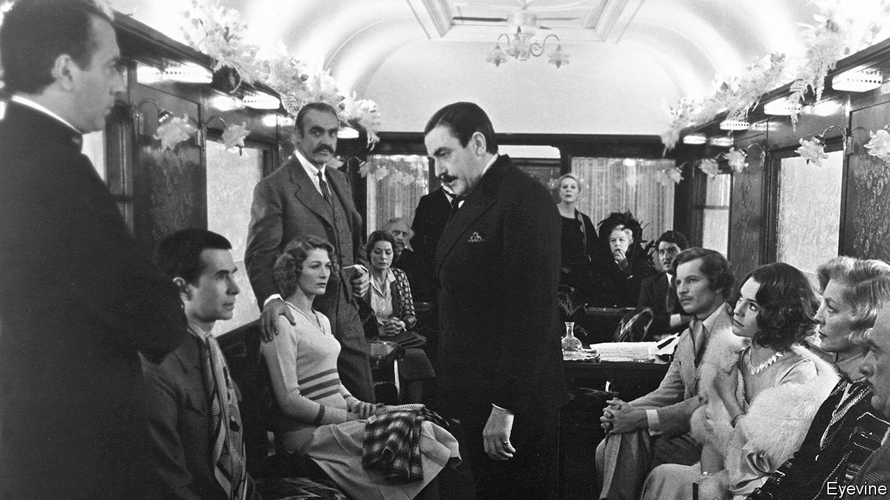

## Little grey cells

# Hercule Poirot turns 100

> The strange case of the Belgian detective

> Sep 26th 2020

“HE WAS HARDLY more than five feet, four inches, but carried himself with great dignity. His head was exactly the shape of an egg…His moustache was very stiff and military.” With this description Agatha Christie introduced Hercule Poirot in October 1920 in her first novel, “The Mysterious Affair at Styles”. In the century since, Poirot’s mannerisms and catchphrases have become familiar around the world; back then, though, the retired Belgian policeman had fled his war-torn homeland and found himself quartered in a sleepy English village. Reunited by chance with his friend Captain Hastings, he is embroiled in the murder of a wealthy, elderly and recently remarried lady. 

Poirot’s first rule of detective work is to avoid “the red fish”, and this case is full of them, from a false beard to a smashed coffee cup. But as he says, underneath it all “the simplest explanation is always the most likely”. It just takes the little grey cells, a fearsome memory and a bit of panache. As Poirot finds throughout his career, the most mundane clues can prove vital: a fire laid on a hot summer’s day, a bath run at an unusual hour, or a throwaway comment about a wasp sting. Anything that does not—how do you say it?—ring of the truth. Anything that appears to upset the natural order of things. 

The pursuit of order is one of Poirot’s great, and most infuriating, missions in life. He grouches about boiled eggs of uneven sizes and people who fail to fold newspapers symmetrically. He flicks away an “imaginary speck of dust”. After all, a close eye for detail was absolument essentiel in becoming “probably the greatest detective in the world”. Self-belief was never in short supply, either.

In 1920 the Styles case propelled the “funny little man” to celebrity. He arrived at a disorienting time in Britain, amid rapid urbanisation and the loss and disillusionment bequeathed by the first world war: a perfect moment for a heavily accented continental to drop in and hold up a mirror. Yet Poirot’s foreignness was part of the bond Christie forged between the detective and her readers. Both he and they were outsiders in the cases he took on, given the same information and solving the same puzzles. She even provided floor plans and diagrams, so readers could try to crack the crimes alongside Mr P.

For murder seemed to follow him wherever he went, from rural England and the back alleys of London to the Orient Express and the River Nile. Bien sûr he made mistakes, and even had to dodge assassination attempts, but he always got his man—or woman. Or both. Given all the marital strife that he saw, it was little wonder that he had no time for romance. (Well maybe just the once, with an elusive countess, but it soon fizzled out.) He seemed content with bachelorhood, surrounded as he was by close friends including Hastings, his secretary Miss Lemon and the begrudgingly admiring Chief Inspector Japp of Scotland Yard. 

He helped make Christie the world’s bestselling novelist, and it wasn’t long before he leapt, or waddled, from page to stage and screen. Albert Finney was nominated for an Oscar for his impersonation of the Belgian in Sidney Lumet’s “Murder on the Orient Express” (1974), a film boasting one of the starriest-ever casts. That was a fitting tribute to Poirot’s global prestige, even if the denouement was un peu over-the-top (the real sleuth did not lose his cool so easily). Other imitators included Charles Laughton and Sir Peter Ustinov. But David Suchet captured Poirot’s quirks best, playing him in a British television series from 1989 to 2013. 

Despite his pedantry and eccentricity, Poirot remains one of the best loved characters in fiction. He is pompous, vain and often quite annoying, but endowed with enormous empathy and a powerful understanding of human nature. And he is always right. As Hastings remarks, “Sometimes, I feel sure he is as mad as a hatter; and then, just as he is at his maddest, I find there is a method in his madness.” Over 33 novels and 59 short stories, Poirot elicited the same unswerving faith from his fans.

Christie herself tired of him. She killed him off in a novel written during the second world war but published only in 1975, as her own health failed (the New York Times gave him a front-page obituary). But her exasperation with Poirot was a minority view. His books still sell royally. A glitzy new adaptation of “Death on the Nile”, directed by and starring Sir Kenneth Branagh, is due this autumn (his version of “Murder on the Orient Express” took $350m at the box office in 2017). Sophie Hannah, a British novelist, has resurrected Poirot in a series of new stories.

Perhaps, as he turns 100, what ultimately explains his staying power is that despite all the evil he sees and vanquishes, Poirot remains at heart an optimist. As he discovered all those years ago at Styles, friendship, loyalty and order are the keys to a happy life. With the odd murder thrown in to keep those little grey cells busy. ■

## URL

https://www.economist.com/books-and-arts/2020/09/26/hercule-poirot-turns-100
