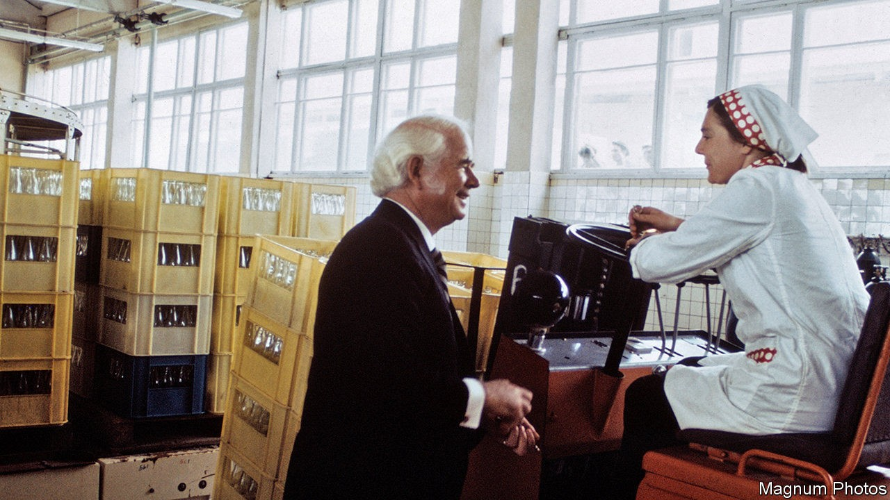
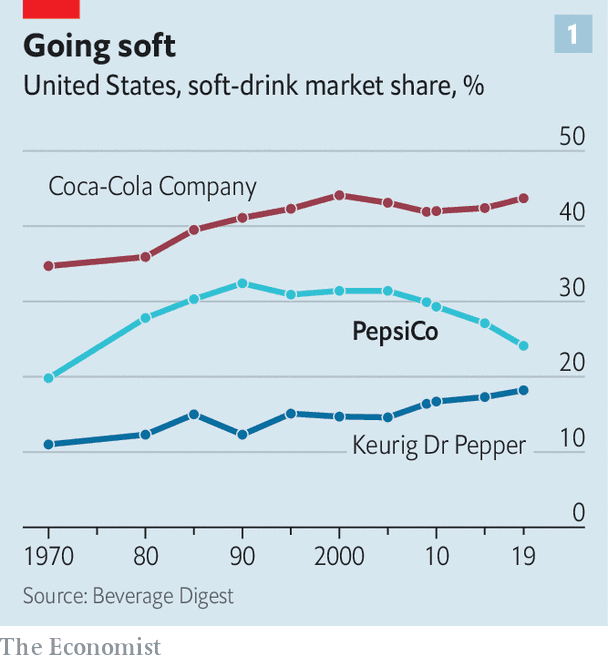
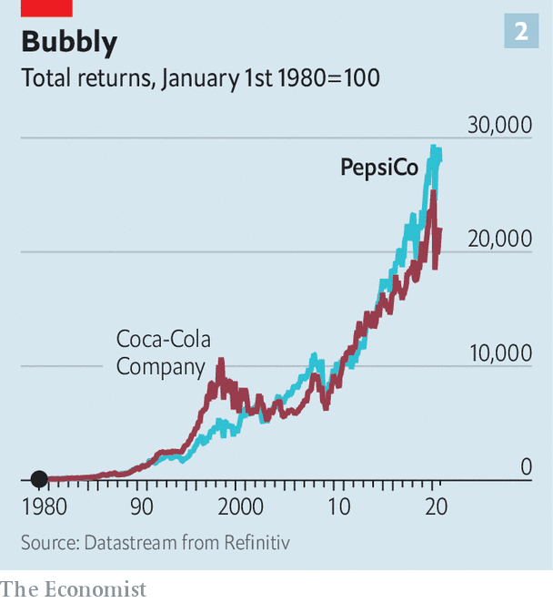

## Fire-starter

# How Donald Kendall, as PepsiCo’s boss, sparked the cola wars

> The legacy of the legendary salesman lives on

> Sep 26th 2020NEW YORK

“ROCK AND roller cola wars, I can’t take it any more!” cried Billy Joel in his chart-topping song from 1989, “We didn’t start the fire”. He had had enough of the intense marketing battle between America’s fizzy-drinks behemoths. As the underdog, PepsiCo had stunned its bigger rival, Coca-Cola, by signing Michael Jackson, the era’s biggest musical star, to promote its brand in a record-setting $5m deal.

The cola wars became a cultural phenomenon. Credit for that goes to Donald Kendall, PepsiCo’s legendary former boss, who died on September 19th aged 99. A gifted salesman, he rose quickly through the ranks from his start on the bottling line to become the firm’s top sales and marketing executive at the tender age of 35. Seven years later he was named CEO. In 1974 he injected a dose of fizzy capitalism into the Soviet Union, which allowed Pepsi to become the first Western product to be legally sold behind the iron curtain. By the time he stepped down as boss in 1986, PepsiCo’s sales had shot up nearly 40-fold, to $7.6bn. His legacy continues to shape the industry.

Mr Kendall offered a mix of strategic vision, principled leadership and marketing flair. Two years after taking charge he acquired Frito-Lay, a leading purveyor of snacks, giving PepsiCo an advantage from diversification that persists to this day. PepsiCo’s revenues last year of $67bn dwarfed Coca-Cola’s $37bn in sales. Decades before Black Lives Matter he named African-Americans to top jobs, making PepsiCo the first big American firm to do so—staring down racists including the Ku Klux Klan, which organised a boycott.

But his masterstroke was the all-out marketing blitz against Coca-Cola, long the global market leader in non-alcoholic beverages. The two firms had competed for decades, but they mostly fought low-grade battles. Mr Kendall changed that, by forcing both companies into an advertising arms race. In 1975 Coca-Cola spent around $25m on advertising and PepsiCo some $18m. By 1985 those figures had shot up to $72m and $57m, respectively. In 1995 Pepsi outspent Coke by $112m to $82m.

This was a risky gambit for both cola rivals. But it paid off in two ways. First, it helped fizzy drinks win a greater “share of throat” (a term coined by Roberto Goizueta, a former boss of Coca-Cola, who died in 1997). They went from 12.4% of American beverage consumption in 1970 to 22.4% in 1985. And though Coca-Cola maintained its lead in that period, with over a third of the market, PepsiCo’s share shot up from 20% to a peak of over 30% in the 1990s. Last year carbonated-drinks sales totalled $77bn in America, and over $312bn globally. Coca-Cola and PepsiCo remain dominant.

The second way that the cola wars benefited both companies was by turning them into “the world’s best marketers”, observes Kaumil Gajrawala of Credit Suisse, a bank. Today a decades-long obsession with cut-price volume growth has been replaced by a focus on revenues and profits.

PepsiCo in particular has relinquished some of the soft-drinks market, where its share has fallen back down to a quarter (see chart 1). But its marketing magic continues to sparkle, even if it is deployed to sell less sugary alternatives such as bottled water, coffee and energy drinks to health-conscious consumers. And over the past 40 years PepsiCo has returned nearly a third more to shareholders than Coca-Cola has (see chart 2).

In many industries a cosy duopoly retards innovation and harms consumers. The happy outcome of the cola wars has been the exact opposite. As Mr Kendall himself observed, “If there wasn’t a Coca-Cola, we would have had to invent one, and they would have had to invent Pepsi.” ■

## URL

https://www.economist.com/business/2020/09/26/how-donald-kendall-as-pepsicos-boss-sparked-the-cola-wars
