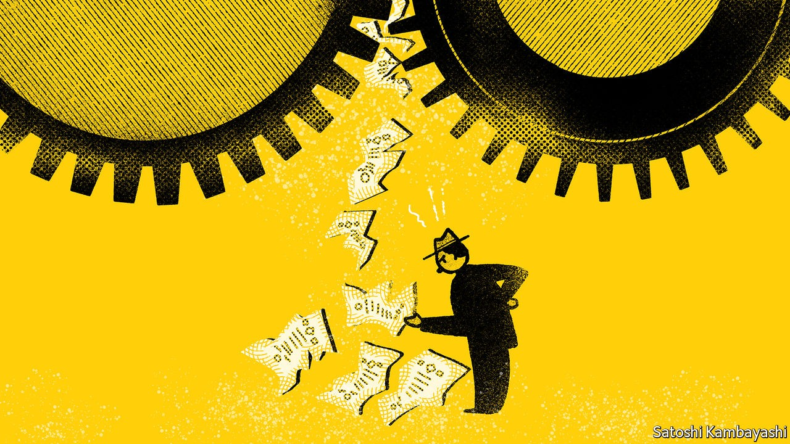

## Buttonwood

# Does economic growth boost stock prices?

> There is sense to the current combination of pessimism and high stock prices

> Sep 24th 2020

THE LATE 1990s is dismissed as a silly era. People left well-paying jobs to join a gold rush in Silicon Valley. Good money was thrown at sketchy business ideas. It was, though, a time of hope. Talk of new-era economics was a little feverish, but there was a genuine surge in productivity in America.

Today is quite a contrast. Optimism is thin on the ground. This is not just a matter of the uncertainties stemming from covid-19. Real long-term interest rates—rough shorthand for GDP-growth prospects—have rarely if ever been lower. Productivity growth has been dismal.

There is a commonality between then and now: steep share prices. The cyclically adjusted price-to-earnings (CAPE) ratio, compiled by Robert Shiller of Yale University, stands a shade above 30. That is a little higher than its level before the 1929 crash, although lower than the peak of 2000. In the 1990s optimism about growth was part of the justification for pricey shares. Now we have pessimism and high prices. Paradoxically, there is more sense to the current combination.

A paper in 2013 by William Bernstein points out that periods of technological change have not been terribly good for stockholders.* The booms of the 1920s and 1990s ended badly. The second quarter of the 19th century—the era of the steam engine, the railways and the telegraph—was no better. The fragmentary evidence Mr Bernstein cites suggests that returns on securities were less than spectacular. Historians of Britain’s “railway mania” of the 1840s find that the social and economic benefits of railways were huge, but investors did not do well.

The value of a share is in discounted cashflows. If you focus on the “cashflows” part of this equation, the 1990s narrative had some logic. Productivity picked up. The speed limit of America’s economy was raised. More growth means more profits. But as Mr Bernstein points out, faster growth does not reliably translate into better returns. In periods of rapid growth, shares are issued at an even faster rate than the growth in earnings and dividends. Each share has a diminished claim on the larger economy. Such dilution is attributable to technological obsolescence. The existing stock of plant and machinery has to be junked more frequently in a fast-growing economy—and fresh assets have to be financed by issuing new capital.

The “discounted” part of the valuation equation must also be reckoned with. As many a buzz-kill noted in the late 1990s, stronger GDP growth often comes with higher real interest rates. At one point real long-term rates were 4% in America. That diminished the value of future cashflows.

Consider a particular blend of these influences—GDP growth, dilution and discount rates—and today’s asset prices start to make more sense. The dilution effect has been largely absent. Until covid-19, American companies had been buying back shares, not issuing more. Discount rates were low, and fell further when the virus struck. People seem as worried about tomorrow’s consumption as about today’s. They are paying handsome prices for vehicles—tech stocks, government bonds, and so on—to carry their spending power into the future.

Over the broad sweep of history, returns have tended to fall as societies become wealthier. A recent Bank of England paper concludes that real interest rates worldwide have fallen over the past five centuries.** Mr Bernstein explains this with a thought experiment. In subsistence societies, almost all the harvest is needed to stay alive. Setting aside capital for seed or housing is desirable. But the surplus is scarce so the rewards for doing without today for the sake of tomorrow—the cost of capital—are high. As economies grow richer, they generate more surplus capital. People are less impatient. If you are well-fed, you can afford to wait. A cheeseburger tomorrow is almost as good as one today. Your discount rate is lower.

There is noise around these trends. At times people suddenly worry a lot more about today’s cheeseburger: the start of recessions, for instance. Personal discount rates go up. Risky assets become cheaper—as they did, briefly, earlier this year. There will no doubt be other opportunities to buy stocks more cheaply again. But as Mr Bernstein’s study suggests, such episodes are likely to be more fleeting than in the past.

*“The Paradox of Wealth”, by William J Bernstein, Financial Analysts Journal (2013).

** “Eight centuries of global real interest rates, R-G, and the ‘supra-secular’ decline, 1311–2018”, by Paul Schmelzing, Bank of England Working Paper No 845 (2020).

## URL

https://www.economist.com/finance-and-economics/2020/09/24/does-economic-growth-boost-stock-prices
