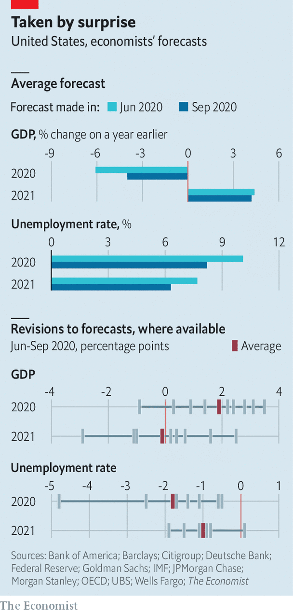

## Snapback

# Why is America’s economy beating forecasts?

> A retreat of the virus, a big stimulus and a flexible labour market is causing faster growth

> Sep 24th 2020

“WHEN AMERICANS vote in November, unemployment will be below 6%,” declared Lars Christensen, a maverick economist, in May. Given that lockdowns had sent the unemployment rate soaring to 14.7% only the month before, it was a bold prediction. In June at least 14 of the Federal Reserve’s 17 interest-rate-setters forecast that quarterly unemployment at the end of the year would still be above 9%. Most other prognosticators were equally gloomy. They expected American GDP to collapse in 2020 and recover relatively slowly. Mr Christensen insisted that natural disasters, unlike financial crashes and recessions brought on by economic policy mistakes, are typically followed by rapid recoveries.

He may be proven right. Over the summer the unemployment rate fell fast, to 8.4% in August. And economists have scrambled to upgrade their growth forecasts (see chart). On September 16th the OECD, a rich-country think-tank, predicted that the American economy would shrink by 3.8% this year, rather than the 7.3% expected in June. The outlook was upgraded across the rich world, but nowhere by as much. America still faces a recession about half as deep again as the one it endured after the financial crisis. But expectations are not as apocalyptic as they were—and look better than they do in most of Europe.

The upgrades in America can be attributed to three factors. First, the spread of the coronavirus in the southern “sunbelt states”, which rode a wave of the epidemic in the summer, has slowed. Second, America’s economic stimulus, the world’s largest both in absolute terms and as a proportion of GDP, has been potent. Thanks to one-time stimulus cheques worth up to $1,200 per person and an extra $600 a week in unemployment-insurance (UI) payments, households’ disposable income has risen since the pandemic began. Americans did not spend the money all at once, meaning that it continues to support consumption today, even though most of the emergency support has expired. In early September UI recipients were still spending more than they did before the pandemic hit.

The final reason behind the forecast revisions is probably America’s flexible labour market. The fall in unemployment in recent months seems to reflect more new jobs, rather than discouraged workers exiting the workforce. In Europe governments have tended to assume much of the payroll cost for furloughed workers. Such schemes are handy in a tight spot. But if prolonged, they could keep workers in jobs that are never coming back. America, by contrast, has mainly protected people’s incomes with unemployment benefits (although it has absorbed the payroll costs of many small businesses via loans that may eventually be forgiven). As a result the reallocation of labour from dying industries to up-and-coming ones is happening at speed. For example, the number of travel agents has fallen by 10% since April, even as overall employment has risen. Employment in general-merchandise shops is 6% higher than before the pandemic.

Much could still go wrong. The virus could surge again, as it has in Europe. Many forecasters continue to assume, optimistically, that Congress will pass another stimulus package this year. Americans cannot run down their savings forever. And social-distancing requirements remain in place in much of the country. As a result some labour-market indicators still look dire. In August, even as the overall unemployment rate fell, roughly 3.4m jobs were permanently culled, more than in October 2008, soon after Lehman Brothers collapsed. The rapid rebound this time could yet hit a hard ceiling. But Mr Christensen’s optimism no longer looks so exceptional. ■

Editor’s note: Some of our covid-19 coverage is free for readers of The Economist Today, our daily [newsletter](https://www.economist.com/https://my.economist.com/user#newsletter). For more stories and our pandemic tracker, see our [hub](https://www.economist.com//news/2020/03/11/the-economists-coverage-of-the-coronavirus)

## URL

https://www.economist.com/finance-and-economics/2020/09/24/why-is-americas-economy-beating-forecasts
