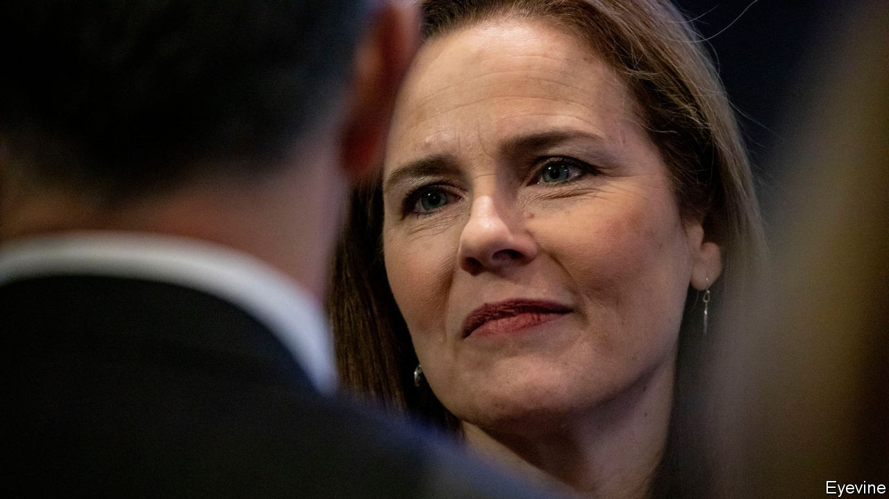

## From RBG to ACB

# What does Amy Coney Barrett think?

> A look at the record of the woman who is likely to be on America’s Supreme Court soon

> Sep 26th 2020NEW YORK

SPEAKING ON FOX NEWS, Lindsey Graham, a Republican senator from South Carolina, conveyed the state of the battle to fill the Supreme Court seat of the late Ruth Bader Ginsburg: “We’ve got the votes to confirm Justice Ginsburg’s replacement before the election,” he said. “That’s what’s coming.” Mr Graham had promised in 2016 to await election results if a Supreme Court vacancy opened in 2020, telling Democratic colleagues, “I want you to use my words against me.” He has now abandoned that pledge. Thanks to his about-face and similar changes of heart from Republican colleagues, Mr Graham’s prediction of a quick vote to confirm a third Trump appointee seems highly likely to come true.

Donald Trump has narrowed his search to five women from the 40-odd candidates on his recently bolstered roster of potential picks. He says he will announce his choice on September 26th. The front-runner—the only candidate Mr Trump has met this week—is Amy Coney Barrett, aged 48, a judge he installed on the Seventh Circuit Court of Appeals in 2017. In contrast to the president’s first two picks, Neil Gorsuch and Brett Kavanaugh, Ms Barrett does not come from an Ivy League university. She attended Rhodes College and got her law degree at Notre Dame, where she taught for 15 years before donning her robe at the appeals court based in Chicago.

Harvard or Yale may not grace her résumé, but Ms Barrett has earned a spate of academic accolades, from Phi Beta Kappa in college (an honorary society for high- achieving students) to summa cum laude honours and a law-review editorship at Notre Dame. She had two impressive judicial clerkships, one under Justice Antonin Scalia. She enjoys the support of an ideologically diverse array of former students and faculty at Notre Dame. She is telegenic—a priority for the president.

Ms Barrett also has a long paper trail, notably her writing on the balance between upholding the law and personal faith. In a typical confirmation hearing—where senators solidify their votes only after listening to the nominee—that might be a liability. But with most openly lining up in the “yea” or “nay” column before questions begin, those writings will probably represent only minor speed bumps.

In 1998 Ms Barrett co-wrote “Catholic Judges in Capital Cases”, a look into “whether judges are sometimes legally disqualified from hearing cases that their consciences would let them decide”. The question is profound. Ms Barrett is a devout Catholic with ties to the People of Praise, a charismatic community teaching that husbands have authority over their wives. Several Democratic senators worried during her 2017 hearing that this religious conviction may not mix well with service on the bench; Dianne Feinstein of California observed that “the dogma lives loudly within you”. That comment flopped, as Ms Feinstein seemed to be criticising the nominee’s deeply held beliefs.

Ms Barrett’s 1998 article contains a rejoinder, that it is “inconsistent” with the constitution’s bar on a “religious test” for office “to suggest that Catholics, simply by virtue of being Catholics, are disqualified from serving as judges”. Responsible Catholics must consider the dissonance between law and their faith “seriously”, she wrote, and should not “align” the legal system with “the Church’s moral teaching”. In their private lives, however, they should “conform their own behaviour to the Church’s standard”. Does that simply means Catholic judges should not have abortions, carry out executions or practise euthanasia themselves? This is an area Democrats will seek to clarify.

The status of abortion rights is a central concern for both American liberals and conservatives. Ms Barrett will frighten the former and delight the latter with her position that abortion is “always immoral”. She said repeatedly in her 2017 hearing that as a circuit-court judge she would be bound to “faithfully apply all Supreme Court precedent”—including Roe v Wade, the 1973 decision recognising a constitutional right to abortion. Were she to ascend to Justice Ginsburg’s old seat, however, Ms Barrett would be empowered to reconsider Roe and other long-standing precedents. Josh Hawley, a strongly pro-life Republican senator from Missouri, is satisfied that Ms Barrett will vote to overturn Roe once she has the opportunity—a requirement, he insists, if a nominee is to earn his support. Ms Barrett “clearly meets that threshold that I’ve talked about”, Mr Hawley said on September 21st. That may mobilise Mr Trump’s evangelical supporters but scare off moderate voters—particularly women.

The speed with which Mr Trump is proceeding is a sign he would like to get a nominee confirmed in time for the election. He supplied a reason for that on September 21st. “We should act quickly”, he said, “because we’re going to have probably election things involved here, because of the fake ballots they’ll be sending out, which is terrible.” The president seems to believe that if he does not score a clear victory in November, having a third justice in place will be key to the success of his plan B: litigating his way to a second term.■

Dig deeper:Read the [best of our 2020 campaign coverage](https://www.economist.com//us-election-2020) and explore our [election forecasts](https://www.economist.com/https://projects.economist.com/us-2020-forecast/president), then sign up for Checks and Balance, our [weekly newsletter](https://www.economist.com//checksandbalance/) and [podcast](https://www.economist.com//podcasts/2020/01/24/checks-and-balance-our-new-weekly-podcast-on-american-politics) on American politics.

## URL

https://www.economist.com/united-states/2020/09/26/what-does-amy-coney-barrett-think
