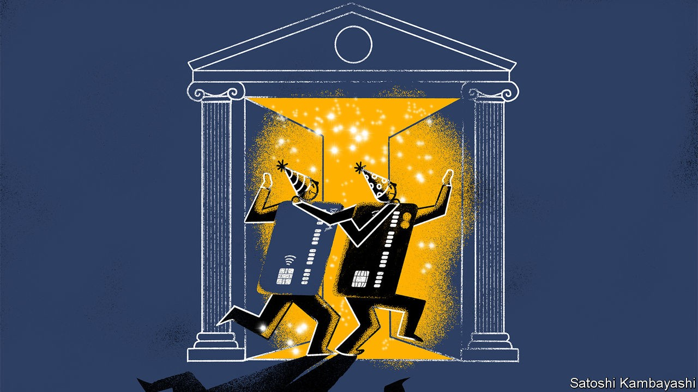

## If you can’t bill ’em

# Mastercard and Visa seek to get the most out of the digital-payments boom

> The credit-card duopoly is crashing the faster-payments party

> Oct 3rd 2020

THE GREATEST accolade a payment system can aspire to is to be forgotten about. “People don’t want to make payments,” says Diana Layfield, an executive on Google’s payments team. “They want to do what a payment facilitates.” The industry’s biggest battles therefore often happen in the shadows. The latest struggle, which sees card networks, tech firms and governments vie to control the virtual pipes along which digital money flows, is no exception. Recent manoeuvres by governments, card networks and even SWIFT, the main interbank messaging service for cross-border payments, show how the battle lines are shifting.

An electronic-payment system used to resemble a postal service for money. Many countries have a low-cost, national payment network, mandated by the government, that transfers funds between banks. Like post, the money could take days to arrive; tracking it was tricky. So automated clearing-houses (ACH), as the national systems are known, were mostly used to disburse recurring payments, such as payrolls or benefits, which do not need immediate authorisation. For one-off transactions, like shopping, people used private card networks, which allow for instant checks via technology embedded in terminals.

As the digital economy has boomed, however, many governments have upgraded the pipes so they can clear and settle online transactions in seconds. Today 55 countries, from Canada to Singapore, have “real-time” bank-to-bank payment systems. Half a dozen more are close to launching theirs. In addition to money, “fast ACH” also allows a lot of data to travel, so senders and recipients can keep tabs on the whole process, potentially preventing fraud. Central banks think they are reliable and more resilient. Tech firms, like Google, have built their own payments apps on top of such “rails”. And users enjoy moving and tracking money seamlessly.

Credit-card firms, though, sense a threat. So Mastercard and Visa, which together handle 90% of global card payments outside China, have found a clever response: to get in on the action. On September 29th Mastercard said it would collaborate with ACI Worldwide, which makes software for real-time payments systems, to provide such services globally. That continues an attempt to shift away from plastic that Mastercard embarked upon in 2016, when it bought Vocalink, a software firm that built and now runs Britain’s fast ACH, and also powers those in other countries. For its part, Visa has set up its own alternative to fast ACH, called Visa Direct, and offers services, such as security tools, to help strengthen countries’ payment networks.

For now national payment systems remain just that—national. Though built along similar principles, most cannot work together (European systems are the exception). That leaves space for others. Some specialist firms have built their own set of rails that help banks in one country connect to local payment networks in another. SWIFT, which has long been criticised for its slow speed and high cost, is upping its game. On September 17th it unveiled a strategy to “facilitate instant, seamless, secure payments” using cloud technology. That would be like leaping from the costly and cumbersome process of sending a parcel abroad to the convenience of email.

SWIFT’s plans could fast gain traction; the co-operative has more than 11,000 members, most of which are banks. But the card networks see an opening here too. Last year both Mastercard and Visa acquired firms that process bank-to-bank transfers by connecting directly into local clearing systems. Plastic is becoming less of a mainstay: this week Mastercard called itself a “global multi-rail payments technology company”. Paul Stoddart, who is in charge of new payment platforms at the firm, describes its forays as a way of offering customers choice. With both card and fast ACH payments growing at double-digit rates in recent years, the boom in digital payments should mean there are plenty of gains to go around. Just in case, though, the card networks are betting on every horse. ■

## URL

https://www.economist.com/finance-and-economics/2020/10/03/mastercard-and-visa-seek-to-get-the-most-out-of-the-digital-payments-boom
