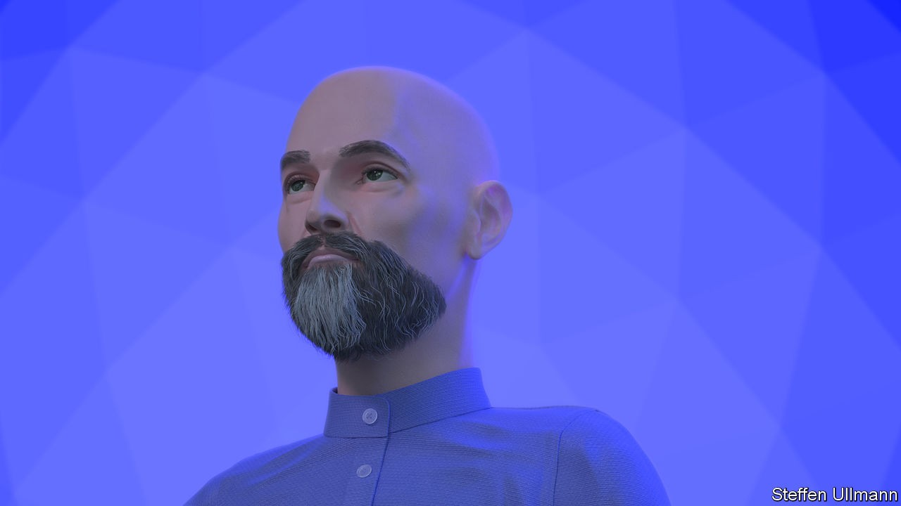

## Brain scan

# A novelist’s vision of the virtual world has inspired an industry

> Neal Stephenson is lord of the Metaverse

> Oct 1st 2020

IN THE LATE 1980s, a young author named Neal Stephenson was working on a project to create a graphic novel. He typed in some code on his Apple Macintosh II and a pair of spherical mirrors appeared on the screen, hanging in space. To make the images look more realistic, the code he used calculated how light bounced off the objects in the frame, so each mirror featured on it a convincing reflection of the other.

“At the time it was unbelievable that you could use code to generate that kind of an image,” he recalls. He remembers having two conflicting thoughts: 3D computer graphics presented a tremendous opportunity to create a whole new medium, but they were too expensive and too difficult to make.

“And so I got to thinking about what could make it cheap,” he says. Television had started out as an expensive curiosity and then became cheap and accessible by becoming a mass-broadcast medium. Mr Stephenson began to imagine what might be necessary to bring about a similar transition for 3D computer graphics. “I was trying to imagine what a popular medium would look like, centred on the use of the 3D graphics technology. And the Metaverse was my best guess as to what something like that might look like.”

Introduced to the world in 1992 in his novel, “Snow Crash”, the Metaverse was a persistent virtual world—accessible to individuals via special goggles—in which people could meet, claim territory, build things, make money and more.

The impact of Mr Stephenson’s idea on the real, non-fictional world has been profound. Ask anyone working to create interactive 3D virtual environments what has inspired them, and “Snow Crash” will be somewhere on that list.

That explains why Mr Stephenson is also a sought-after futurist in Silicon Valley. Over the years he has been tapped by firms including Blue Origin, Jeff Bezos’s space-launch company, and most recently as “chief futurist” for Magic Leap, a startup making augmented-reality glasses.

Today it is Mr Stephenson’s vision—a social, persistent, virtual-reality 3D space accessible to anyone and which will one day be a successor to today’s internet—that many tech companies are seeking to build. One of the biggest supporters of Mr Stephenson’s idea of a Metaverse is Tim Sweeney, boss of Epic Games and creator of Unreal, the game engine that powers “Fortnite” and many other popular games. Mr Sweeney’s stated ambition is to turn such games into some version of the persistent virtual world described in “Snow Crash”.

“One thing I got wrong…was assuming a television model for the development of this medium,” says Mr Stephenson. “What grew instead was games.” Still, he reckons that what makes science fiction useful to people in the real tech world is plasticity—leaving some room for interpretation, so that people who try to implement it can incorporate their own ideas and point of view.

“I think that where Tim and the Epic folks are going with it, is based on an understanding that you do have to start with a game engine if you’re going to build a Metaverse,” says Mr Stephenson. “Because just having a game engine that works, and that is sustainable as a business, is kind of the table stakes. If you can’t do that, you can’t build a multi-user realistic 3D platform.”

## URL

https://www.economist.com/technology-quarterly/2020/10/01/a-novelists-vision-of-the-virtual-world-has-inspired-an-industry
