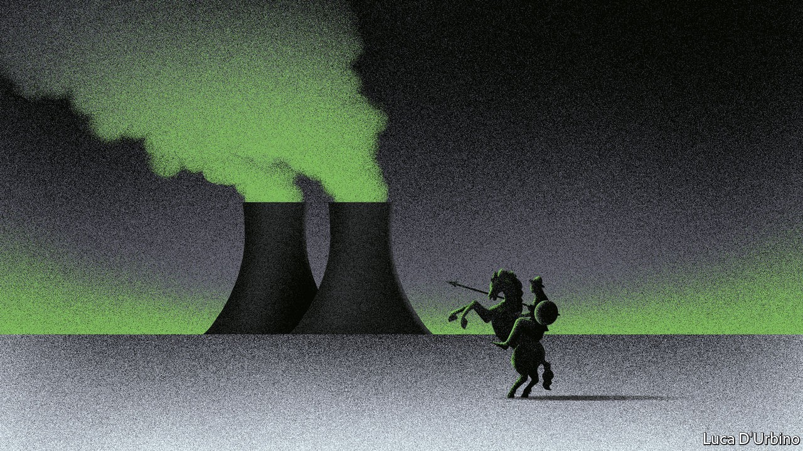

## Green like the Grinch

# The French mayor who cancelled the Christmas tree

> France’s Green politicians are grabbing attention, not all of it positive

> Oct 10th 2020BORDEAUX

STANDING BEFORE potted plants, Pierre Hurmic, the newly elected Green mayor of Bordeaux, announced last month that the town hall would no longer put up a giant annual Christmas tree. No “dead trees on the town square”, he declared. The opposition cried scandal. The mayor was accused of destroying tradition and family fun. A poll showed that 79% of French people disapproved. Even the prime minister, Jean Castex, was moved to deplore the loss of Bordeaux’s traditional Christmas tree.

“It was absolutely not a provocation,” insists Mr Hurmic, who today professes surprise at the “completely disproportionate” fuss that his comment prompted. “I’m not against Christmas trees,” he says. But transporting a 17-metre tree cut from a forest halfway across the country is unjustifiable. “I prefer living trees,” affirms the mayor, who plans to plant them all over an elegant city that in his view is “too mineral” and needs to breathe.

Mayors are making the Greens heard in France. In 2017 the party did not run its own presidential candidate. In Paris it has just five staff members. Yet at elections in June it won nine of the biggest town halls, most for the first time. The row over the Bordeaux Christmas tree is just one of various recent arguments, revealing both a fierce debate within the party, as well as a growing Green influence on national politics.

Last month Grégory Doucet, the Green mayor of Lyon, denounced the Tour de France as “macho” and “polluting”. The annual cycling race is a national treasure. But Mr Doucet dislikes the team cars that follow riders and all the discarded plastic. In nearby Grenoble, Eric Piolle, its Green mayor, said that he would block the roll-out of 5G networks. The technology, he said, is designed for little more than to let people “watch porn in HD, even in the lift”.

Not all Greens approve of the latest outbursts. Once-internal debates are now being aired in public. The party includes not only décroissance (anti-growth) eco-warriors but also moderates who worry that radicals will undermine any attempt to broaden its appeal. Isabelle Saporta, an activist (and partner of Yannick Jadot, a Green Party leader), has accused the mayors of having “one idiotic idea a day”.

The fact that the Green mayors are stirring national debate also reveals how seriously other parties now take the party. Besides winning big cities, the Greens came third—behind Marine Le Pen’s National Rally and Emmanuel Macron’s La République en Marche—at European elections last year. Even the president, who has embraced a more growth-friendly form of greenery, has begun to lay into the eco-radicals. Last month he accused anti-5G lobbyists of wishing an “Amish model”, and the return of the oil lamp, on France.

Back in Bordeaux, cyclists pedal along riverside bike lanes and an electric tram carries passengers back and forth. In the city centre at least, this once-conservative town—ruled for 73 years by the centre-right, including Alain Juppé, an ex-prime minister—had already embraced greener living. Mr Hurmic now wants to fight new speculative development and stop marketing the city as an investment “magnet” to the detriment of the surrounding area. It is not yet clear how he will square this ambition with a battered local economy that depends heavily on pandemic-hit sectors such as tourism, aerospace and wine.

“My impression is that the Greens weren’t ready for power,” says a Bordeaux tech entrepreneur. Others suggest they are moving at an appropriately organic speed. “He’s in fact a very conservative environmentalist,” says Thomas Cazenave, LREM’s mayoral candidate in Bordeaux. No signature measure has been put in place. Last week the council voted merely for an “impact study” on 5G. “I’m not an Amish, that’s ridiculous,” says Mr Hurmic. By mocking the Greens, Mr Macron is both naming his new rivals, and shaping them. ■

For more coverage of climate change, register for The Climate Issue, our fortnightly [newsletter](https://www.economist.com//theclimateissue/), or visit our [climate-change hub](https://www.economist.com//news/2020/04/24/the-economists-coverage-of-climate-change)

## URL

https://www.economist.com/europe/2020/10/10/the-french-mayor-who-cancelled-the-christmas-tree
