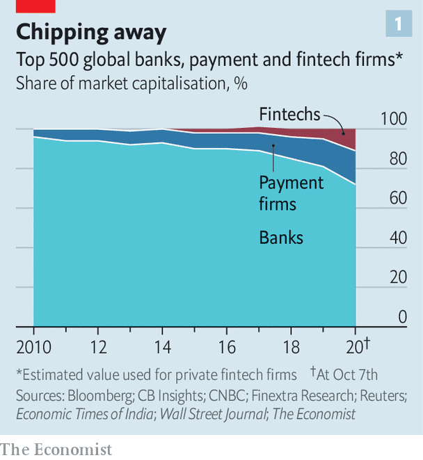
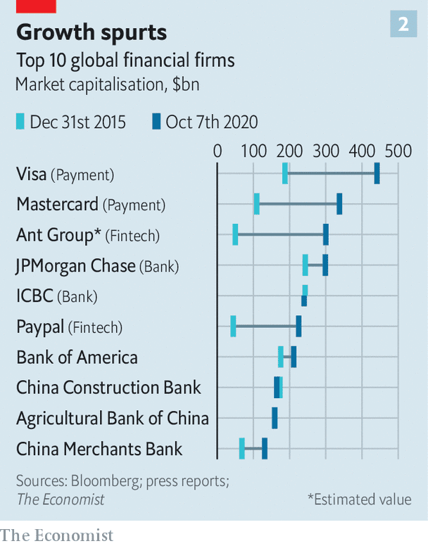
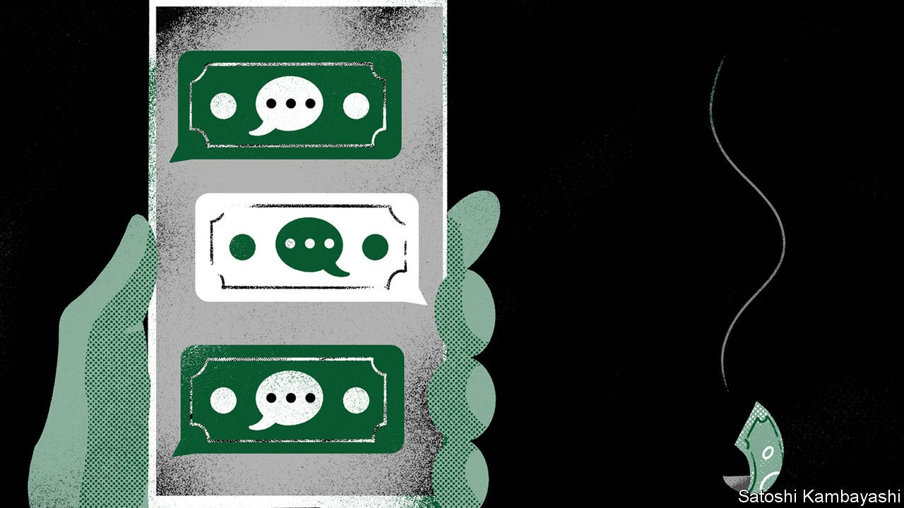

## The digital surge

# How the digital surge will reshape finance

> Thanks to covid-19, more people than ever are banking and making payments online

> Oct 8th 2020

Editor’s note: Some of our covid-19 coverage is free for readers of The Economist Today, our daily [newsletter](https://www.economist.com/https://my.economist.com/user#newsletter). For more stories and our pandemic tracker, see our [hub](https://www.economist.com//news/2020/03/11/the-economists-coverage-of-the-coronavirus)

IN 2012 DAVID VÉLEZ tried to open a bank account in Brazil. “It was like going to prison,” he says. He was ordered to leave his belongings in a locker before walking through bulletproof doors. After waiting an hour, he faced a barrage of questions from a hostile manager. It took five months for him to be offered a bare-bones account costing him hundreds of dollars a year and a credit card charging an annualised interest rate of 400%. The next year, in the hope of eroding Brazil’s crusty banking oligopoly, he founded Nubank, a digital lender. By early 2020 the bank was valued at $10bn.

Then the pandemic came—and business really took off. This year alone the number of accounts at Nubank has risen by 50%, taking the total to 30m. In June it partnered with WhatsApp, which has 120m users in Brazil, to offer payments through the messaging service. In September it bought Easynvest, a digital broker, and launched operations in Colombia. In November Brazil will implement Open Banking, a reform that will give fintechs access to data held by banks, fund managers and insurers. All this, says Mr Vélez, is just the beginning of the digital revolution: “it is only the first second of the first half of the game.”

Just as a digital surge brought on by the pandemic is speeding up a transformation in retail and e-commerce, finance too is being reshaped. The shift from physical to digital payments this year has been dramatic. Pundits canvassed by The Economist reckon that the share of cashless transactions worldwide has risen to levels they had expected it to reach in two to five years’ time. In America mobile-banking traffic rose by 85% and online-banking registrations by 200% in the month of April.

Some firms will cash in on the digital rush, while others will be left behind. Capital markets think a new era is dawning: conventional banks now account for only 72% of the total market value of the global banking and payments industry, down from 81% at the start of the year and 96% a decade ago (see chart 1). Fintech firms such as Ant Group and PayPal make up 11%: their market value has almost doubled this year to nearly $900bn. Conventional non-bank payments firms such as Visa are booming, too, and make up the other 17% of the industry total.

Digitisation may spell the end of the dinosaurs in some industries, such as entertainment or retail. But in finance they seem likely to live on. Banks are well entrenched, albeit to different degrees in different places. Regulators, the gods of their ecosystem, are unwilling to let them die off. So the new and old will coexist, with the precise features of the hybrid system varying from place to place.

The acceleration in digitisation is most visible in payments. Although the crisis has led to an increase in physical cash held by the public, its pace of circulation has fallen, suggesting people are hoarding rather than spending banknotes. Card payments, by contrast, have kept growing. That is partly thanks to the boom in online shopping, which has itself leapt forward by several years. But it also reflects the efforts of brick-and-mortar shops to reach customers online. In the spring Stripe, a firm that powers payments, helped the centuries-old farmers’ market in Paris set up virtual checkouts in place of physical ones, says John Collison, its president. Food-order volumes processed by Marqeta, a payments firm that works with many of America’s restaurant-delivery firms, tripled between March and mid-April.

Shops have reopened, but people are sticking to plastic. Governments in 31 countries have helped by raising limits on contactless payments (and card firms are lobbying for even higher ceilings). Those at Visa and Mastercard, two card networks that account for 94% of transactions processed outside of China, surged by over 40% in the first quarter of 2020, compared with the same period in 2019. Square, which helps small businesses accept credit-card payments, saw its share of fully cashless clients in America jump from 5% in February to 23% in April; it has since stabilised at 14%. In Britain the share now stands at 37% (see chart 3).

The shift goes beyond cards. Hiroki Takeuchi of GoCardless, which helps companies collect payments from bank accounts, says many membership businesses like gyms took the opportunity of shutdowns to upgrade from cash registers to direct debits. Consumers are using peer-to-peer (P2P) services to send money to relatives or buy fitness classes online. Payments processed in America by Venmo, a P2P firm, grew by 50% year-on-year in the second quarter.

Outside the West, mobile wallets, with which you can pay after loading money on to your phone, were becoming commonplace even before the pandemic. The virus has given them a leg up. A third of Singapore’s 18,000 street hawkers let consumers pay by scanning a QR code in July, a boost of over 50% in just two months. Many governments in Africa declared these wallets essential services and banned transfer fees. Amounts held in M-PESA, a mobile-money service ubiquitous in Kenya, rose by a fifth in the month of May alone.

Digitisation is also racing ahead in other areas of finance. As millions of households received stimulus cheques and furlough payments, many took to betting on stocks from their sofas using zero-fee e-brokers. Keith Denerstein of TD Ameritrade, one such broker, says customers worldwide have opened 50% more accounts in 2020 than in its best full year. Meanwhile insurers that relied on agents to sell policies have learnt to do without. Sachin Shah, who runs the Asian unit of Manulife, says 97% of its products can now be bought online.

Banking—the core of retail finance—has not been immune to change. Western lenders report surging connections to their apps and digital sales. Adoption is even faster in emerging markets, reflecting a lower starting point. José Antonio Álvarez, chief executive of Santander, a Spanish banking group that spans three continents, says the use of its digital channels rose by 20% in Europe, 30% in South America and 50% in Mexico in the first half of the year, compared with the first half of 2019.

Digital finance, already a force for inclusion, has brought yet more people into the banking system in recent months. In April DBS, Singapore’s biggest lender, opened 40,000 accounts for migrants in a weekend so that they could send money home digitally. Brazil’s government, which has extended aid to 60m people, is increasingly using the mobile route to reach citizens in the Amazon. Joshua Oigara, the boss of KCB, Kenya’s largest bank, says the number of customers using its app has doubled since covid-19 struck. These moved 35bn shillings ($329m) from their mobile wallets to bank accounts in June—six times more than in January.

These changes in behaviour seem likely to stick. Many customers were unfamiliar with the technology before the pandemic—and surveys suggest they like it. In April nearly a fifth of American adults used digital payments for the first time, reckons Forrester, a research firm. Since February Nubank has gained 30,000 users over the age of 60 every month. In a global survey Bain, a consultancy, found that 95% of consumers plan to use digital banking post-pandemic. And banks, which had already been planning to shrink their physical footprint, are closing branches more quickly than they had envisaged. Brazilian lenders have shut down 1,500 this year, 7% of the total stock. Those in Europe are planning to slash 2,500 branches. Banks will strive to keep the everyday business online, with branches that stay open often being revamped to provide “high-value” services such as advice, says Allison Beer of JPMorgan Chase, America’s biggest lender.

In the middle of the digital rush, a new business model is emerging—and new entrants are being drawn in. Banks, e-commerce sites, fintechs, social networks, taxi apps and telecoms firms are all vying to become “platforms”—marketplaces through which users can buy a range of financial products made in-house or by third parties. “Everybody is trying to become the home page,” says Tara Reeves of Omers Ventures, the venture-capital arm of Canada’s municipal-pension fund. Grab, a ride-hailing app in Singapore that has grown into the country’s most popular mobile wallet, has over 60 tie-ups with banks, insurers and other financial firms. Reuben Lai, who runs its finance arm, says it wants “to be a one-stop platform” that fulfils South-East Asians’ financial needs.

Investors reckon that “embedded finance”—the integration of credit, insurance and investment into non-financial apps or websites—could in time become as valuable as payment services are today. Both banks and fintechs are therefore racing to integrate the services they offer. In September Yandex, Russia’s leading web-search and ride-hailing app, said it would buy the country’s largest digital bank. A week later Sberbank, Russia’s top lender, dropped “bank” from its name in order to rebrand itself as a tech firm dabbling in food delivery and telemedicine. Peter Ndegwa, who runs Safaricom, a Kenyan telecoms firm and M-PESA’s main owner, wants the service to become a “lifestyle brand” offering overdrafts, loans, wealth management and insurance.

The main attraction of the new model is money. As rising competition and, in the rich world, low and falling interest rates reduce lending margins, banks need to diversify. Tech-based challengers, for their part, want to increase the stickiness of their apps so they can sell more of their core products, or take a cut of the financial wares they distribute for others. As physical branches become irrelevant, finance is exposed to the same network economics that have upended other sectors. Huw van Steenis of UBS, a bank, thinks the pandemic is accelerating a “winner-takes-most” dynamic, where popular platforms attract exponentially more traffic.

Much of the gains could come from the ability to merge and exploit data long siloed within different financial services. Armed with a full picture of users’ behaviour, firms hope to use algorithms that spit out tips on, say, how to save for a dream house. That will make the platforms even stickier and allow them, in turn, to recommend yet more products. Backbase, a fintech that designs digital-banking software for incumbents, is also working on such wizardry. “The more people share their daily lives with you, the more you can give them these additional benefits,” says Jouk Pleiter, its boss.

Though it has obliterated incumbents in other industries, Big Tech has contented itself with skirting around the margins of finance. Apple has launched a credit card with Goldman Sachs, and a payment tool. Facebook’s payments efforts have made little headway. The number of American e-commerce sites that use Amazon’s checkout button is rising only slowly, says Lisa Ellis of MoffettNathanson, a research firm. Google has teamed up with banks to offer current and saving accounts; in India, where its payment app is dominant, it doles out instant loans to shoppers. But Diana Layfield, a payments executive at Google, is adamant that it does not want to become “a grand unifying platform”. (That may be because it is eyeing a juicier market. The financial industry, at first slow to move data to the cloud, is becoming keener to do so. That will most benefit: Alibaba, Ant’s former parent group; Amazon; Google; and Microsoft.)

Where does all this leave banks? Many fintechs, with their shinier apps and better risk analytics, certainly have an edge over them. But these firms are not trying to usurp lenders. This is because banking is made of two parts, says Miklós Dietz of McKinsey, a consultancy. “Core banking”—heavily regulated, capital-intensive activities such as running a balance-sheet—makes $3trn in revenue worldwide, and returns on equity (ROE) of 5-6%. By contrast, freer-wheeling lines of business, such as payments or product distribution, yield $2.5trn in sales but ROEs of 20%. Fintechs are after the tasty bits. But for this, they need banks to stay alive.

To see how coexistence might work, look to China. The duopoly of Tencent and Ant use powerful algorithms to price and distribute a fast-growing portion of the loans made to consumers and small firms in the country (see [Briefing](https://www.economist.com//briefing/2020/10/10/what-ant-groups-ipo-says-about-the-future-of-finance)). Yet the products they sell are held on banks’ balance-sheets. Despite the hefty cut they take—gobbling up a big chunk of the lenders’ profit—banks still accept the deal, because they crave access.

But coexistence will take varied forms across the world. Some banks may be better suited to the new world of tech than others, itself a function of the state of banks today. Dirk Vater of Bain sees a strong link between a bank’s digital performance and how badly it was hit by the financial crisis of 2007-09. European banks, burdened by dud loans and low interest rates, spent the 2010s cutting costs rather than investing in transformation. Their apps can do little. By contrast the Commonwealth Bank of Australia, based in a country unscathed by the financial crisis, has built an app that has won plaudits for offering Netflix-like personalised service. It notifies users when bills are due and advises them on their tax returns. Piyush Gupta, DBS’s boss, says it spent the past few months plugging “last-mile” gaps so that complex products, such as mortgages, can be sold online.

Regulation will also determine how much tech firms can prise away from the banks. China long let them roam free (though it has recently clawed back some of that liberty to protect the banks). At the other extreme, America has shielded banks and credit-card firms the most, by being slow to build fast-payment pipes and making it hard to gain digital-banking licences. It has left it to the market to decide when data should be shared, and at what price. Europe and many emerging markets are somewhere in the middle. These have tried to instil competition by allowing data to flow. Some version of Open Banking will soon be in force in 51 countries, ranging from Malaysia to Mexico.

Bring these initial conditions together, and you start to see why certain financial systems are where they are today, and where they might end up. America is at stage zero. Customers are locked into sticky credit-card schemes funded by extortionate levies on merchants. Tech firms must rely on creaky financial plumbing run by well-protected incumbent banks.

At the next stage, banks would still run the infrastructure, but payments and other non-core tasks would be open to new entrants. European fintechs, for example, can initiate transfers but they still move money between bank accounts. In Sweden they originate 60% of consumer loans.

At stage two, payments would routinely cut out the incumbents—like, for instance, the flows between Africa’s mobile wallets, which do not transit through banks. But most other financial services would still involve them. Stage three is the realm of “super-apps” like Grab and Gojek in South-East Asia, which started as ride-hailing services, or Mercado Pago, the financial arm of MercadoLibre, Latin America’s largest e-commerce site. These want to become financial supermarkets that offer a range of products mostly manufactured by others. The most advanced incarnations of these are the super-apps in China.

For as long as regulators are determined to keep banks alive, stage four, where non-banks dominate both the production and distribution of financial services, will probably never come to be. With so many countries so far off the frontier, though, this hardly rules out dramatic change over the years ahead. ■

## URL

https://www.economist.com/finance-and-economics/2020/10/08/how-the-digital-surge-will-reshape-finance
