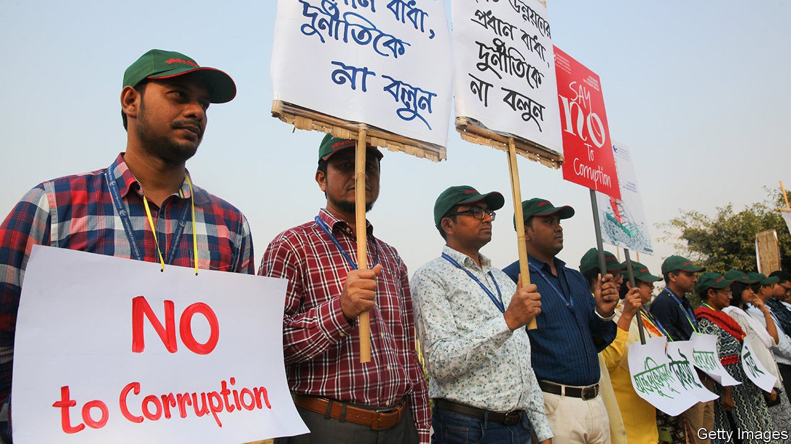

## Land of land-grabs

# A crackdown in Bangladesh reveals corruption on a daunting scale

> Even locals are surprised at the scale of the looting

> Oct 17th 2020

IN FARIDPUR, A small provincial town in Bangladesh, it is hard to keep a secret. Everyone knows not just that Sajjad Hossain and Imtiaz Hasan, two brothers who until recently headed the local branch of the ruling Awami League, are very rich, but also how they came to be so. Over the past seven years they acquired more than 300 hectares of land at rock-bottom prices. Sellers apparently felt that the brothers’ low offers could not be refused—perhaps because they had connections to Sheikh Hasina Wajed, the prime minister, or because complaints about them to the police seemed to fall on deaf ears. No longer: a recent criminal investigation into the Faridpur division of the Awami League found that some $340m had passed through the brothers’ 49 accounts. Along with other local Awami League leaders involved in the scandal, the brothers now await trial, on charges of money-laundering.

If the scale of the pair’s empire surprised many, so did the fact that it ever came to light. Their arrest is the latest in a series of moves to clean up the ruling party. At the start of the covid-19 pandemic, Sheikh Hasina berated her party’s members for pocketing rice intended for the poor. In July two hospitals in Dhaka found to be issuing fake negative-test certificates for hefty fees were raided by the Rapid Action Battalion, an elite police unit. Mohammad Shahed, chairman of the Regent group, which owns the hospitals, was jailed on corruption charges. Last year wads of discarded cash were found in Dhaka’s rivers after the prime minister ordered raids on the city’s underground casinos, mostly run by high-up officials in the Awami League and their cronies.

Sheikh Hasina has complained about corruption since she came to power in 2009, but has shown much more vigour in the past year and a half, says Iftekhar Zaman from Transparency International Bangladesh, a watchdog. The crackdown, he argues, is mainly driven by the prime minister’s hankering for legitimacy, which is in doubt because she has squeezed the pips out of the opposition and run the country with a crushing parliamentary majority for the past 12 years. The scourge of covid-19 risks further harm to the government’s standing. Making a song and dance about corruption diverts voters’ attention, says Mr Zaman, and suggests that the Awami League is, as it claims, “working in the public interest”.

The crackdown may also reflect divisions within the ruling party. The raids on casinos chiefly netted members of the Awami Youth League. Omar Faruk, its leader at the time, accused the police of hypocrisy, claiming they had been complicit in the thriving casino business for years. The crackdown, he said, was a politically motivated “plot”. He was removed from his position, along with many others in the Youth League. But the main reshuffle, says one observer, was of Dhaka’s underworld: the Youth League’s ousting allowed gangsters with connections to other bits of the party to muscle in on the casino business.

In the Faridpur case, the accused named a local Awami League politician, Khandaker Mohtesham Hossain, as their “protector”, alleging that he took a 2% cut of the spoils (he denies it). His brother, Khandaker Mosharraf Hossain, the local MP and a former minister, is the father-in-law of Saima Wajed Hossain, Sheikh Hasina’s daughter. Bangladeshis speculate that allegations that such grandees were involved reflect a power-struggle within the party.

Whatever the explanation for it, the sudden anti-corruption drive, far from burnishing the Awami League’s image, seems to have horrified many Bangladeshis by revealing that the problem was even bigger than they had realised. “I knew there were casinos in Dhaka,” says Mr Zaman, but the number—at least 60, according to reports—was “surprising even to me”. The suspected abuses in Faridpur, he notes, began long before the current government took office. But their exposure has reinforced the widespread suspicion that many politicians see their jobs as “a licence for self-enrichment”. ■

## URL

https://www.economist.com/asia/2020/10/17/a-crackdown-in-bangladesh-reveals-corruption-on-a-daunting-scale
