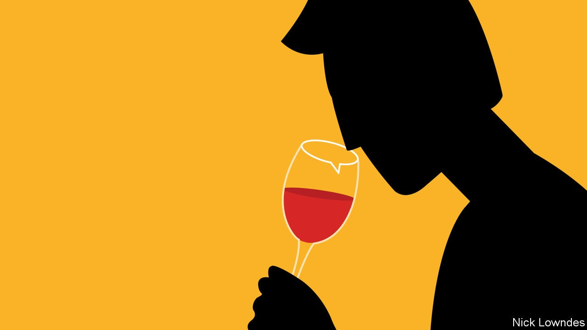

## Johnson

# Does naming a thing help you understand it?

> The fruity language of wine offers a clue

> Oct 17th 2020

“OAK” AND “fruit forward” are for wine amateurs. “Cedar” and “barnyard” are for real connoisseurs, and only a professional would have the confidence to deploy “gravel” or “tennis balls”. One tasting note says a wine has hints of “mélisse, lemon-balm”. If you are wondering what “mélisse” is, don’t bother: it is actually just French for “lemon-balm”.

The language of wine is easy to mock. It can be recondite, even downright obscure. Oenophiles make a convenient subject for ridicule: if their cellars require such a wide-ranging lexicon, they are probably rich enough to cope with it. But wine vocabulary has its uses. Among the vast array of tastes, perhaps even flowery labels help experts pinpoint odours and flavours that they are interested in and want to remember. If you have a name for something, it may be easier to keep it in your head.

Perhaps. You might have heard the stereotyping joke about women having hundreds of words for colour in their vocabularies because they love to shop, but men having just the eight that come in a child’s crayon box. This is a caricatured and simplified version of Ludwig Wittgenstein’s view that “the limits of my language mean the limits of my world.” The underlying argument is that having a name for something lets you understand it. But researchers have found that the links between perception, cognition and language turn out to be more complicated than that.

The debate over the relationship between thought and language is one of the most heated in psychology and linguistics. In one corner is the “Sapir-Whorf hypothesis”, named after two early-20th-century American linguists, who posited that the world is made up of continuous realities (colour is a classic example) that are chopped into discrete categories by language. People perceive what their vocabulary prompts them to. An extreme version of this theory holds that it would be difficult, even impossible to distinguish colours—or wine odours or flavours—without names for them.

On the other side of the debate are those who say that although language is indeed linked with cognition, it derives from thought, rather than preceding it. You can certainly think about things that you have no labels for, they point out, or you would be unable to learn new words. Supposedly “untranslatable” words from other tongues—which seem to suggest that without the right language, comprehension is impossible—are not really inscrutable; they can usually be explained in longer expressions. One-word labels are not the sole way to grasp things.

Into this dispute comes a new study of wine experts and their mental labels. Ilja Croijmans, Asifa Majid and their colleagues gave a host of wine experts and amateurs a number of wines and wine-related flavours (such as vanilla) to sniff. Some from each group were told to name the odours they encountered; others were not. Then they were given a distraction to clear their minds, followed by a chance to recollect what they had smelled. As expected, the experts performed better than the amateurs—but those who articulated their thoughts did no better than those who had not.

Some who did not label the odours out loud may have done so in their heads. So the researchers conducted a second experiment. Some subjects were distracted while sniffing by a requirement to memorise a series of numbers, making it harder for them to verbalise what they smelled, even mentally. They did no better or worse than a second group who were given a visual distraction (memorising a spatial pattern), or a control group with no distractions.

The team conclude that olfactory memory in wine experts, at least, is not directly mediated by language. This is not to say such language is useless. Vinologists describe wines more consistently than amateurs do, meaning that—contrary to sceptical gibes about their pretentiousness—they are not just making up what they taste.

Ms Majid says that rather than ask whether language affects cognition—since it clearly seems to, at least some of the time—the real question is what functions it affects. Perception, discrimination and memory are not the same thing, and some might be swayed by language more than others. Mr Croijmans compares words to a spotlight, which may not give you the ability to perceive things you could not otherwise, but rather help separate them from the background. That is a rather more positive version of Wittgenstein’s aphorism: language not as a limit, but as a light.

## URL

https://www.economist.com/books-and-arts/2020/10/17/does-naming-a-thing-help-you-understand-it
