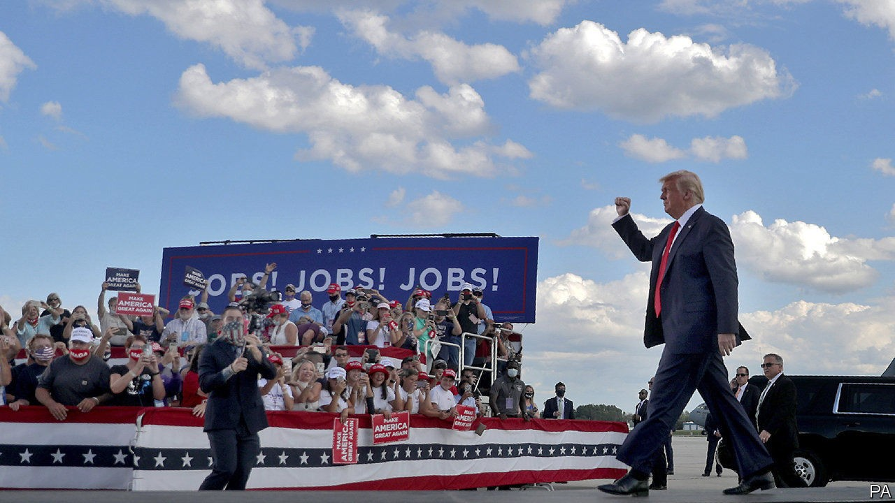
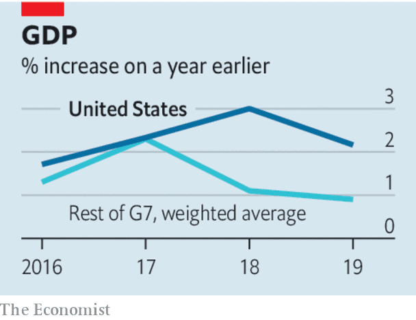

## Grading Trumponomics

# How to judge President Trump’s economic record

> Before the pandemic Trumponomics got one thing right and one thing wrong

> Oct 17th 2020

PRESIDENT DONALD TRUMP says Americans should re-elect him because of his record on the economy. Before covid-19, America enjoyed its lowest unemployment rate in 50 years, fast annual wage growth of almost 5% among the lowest-paid workers and a buoyant stockmarket. Mr Trump attributes all this to his three-pronged strategy of tax cuts, deregulation and confrontational trade policy, and says more of the same will revive the economy after the pandemic. Many voters agree. The economy is one issue where Mr Trump does not face a big deficit in the polls.

Yet his administration’s economic record from before the pandemic is mixed. It got one thing right: when Mr Trump took office the economy was still in need of stimulus, which tax cuts and more spending helped provide. But that success has also helped conceal the damage done by his protectionism.

Trumponomics has not achieved what its proponents forecast. While campaigning in 2016 Mr Trump predicted economic growth of 4% or more; in office the target was cut to 3%. Between the start of 2017 and the end of 2019 America grew by an annual average of 2.5%, barely faster than the 2.4% growth of the three preceding years. The Trump administration argued that tax cuts would pay for themselves and that cutting red tape for business would spur investment. In reality the budget deficit rose from 4.4% to 6.3% of GDP, on the IMF’S measure, and although deregulation did help boost business confidence there was no sustained jump in investment growth.

Both regulatory and tax reform have reined in some bad policies, such as tax deductions for mortgage interest and state and local taxes. But improvements like this are, relative to the size of the economy, small. In the three years to 2019 the administration says that it eliminated $51bn of regulatory costs, which is only about 0.2% of one year’s GDP and ignores any public benefits from regulation. Most estimates suggest the long-term boost to growth from Mr Trump’s tax reform will be about a tenth of a percentage point per year or less.

What was exceptional about America’s pre-pandemic economy was not, therefore, its supply side, nor even its jobs boom, which was replicated across the rich world. It was that as global economic growth slowed sharply in 2018 and 2019, America’s growth fell only relatively gently (see [article](https://www.economist.com//united-states/2020/10/14/how-the-american-economy-did-under-donald-trump)). That was because it was temporarily propped up by a bigger budget deficit. Mr Trump can take some satisfaction from his pump-priming. In 2017 many economists argued that it was a bad time for stimulus because the economy and the labour market had reached their limits; in 2018 the Federal Reserve, coming to a similar judgment, raised interest rates four times. It turned out that there was still plenty of slack. As a result the fiscal splurge caused faster growth than seen elsewhere in the rich world without provoking much inflation. Interest rates came down again, making public debt more affordable.

The irony is that a crude stimulus to growth might not have been necessary were it not for Mr Trump’s trade war and tariffs, which hurt confidence and weighed on global growth. Before the pandemic the IMF estimated that the fight between America and China might wipe nearly 1% off global output. America offset this drag, rather than escaping it altogether. Recent research suggests that Mr Trump’s tariffs destroyed more American manufacturing jobs than they created, by making imported parts more expensive and prompting other countries to retaliate by targeting American goods. Manufacturing employment barely grew in 2019. At the same time tariffs are pushing up consumer prices by perhaps 0.5%, enough to reduce average real household income by nearly $1,300.

Taken together, the various strands of Trumponomics offer three lessons. First, there are big benefits to running the economy hot and keeping the job market tight, particularly for poor workers. Policy should be aimed at restoring these conditions as quickly as possible after the pandemic. If that means running large deficits while interest rates are low, so be it (although given the parlous state of America’s infrastructure, the money would be better spent on growth-boosting investments than on regressive tax cuts). Second, in already deregulated economies supply-side reforms may not always show up much in GDP growth. That does not make them undesirable—it is good to eliminate tax breaks—but it does mean politicians should not make wild promises about growth, which is weighed down by immutable forces such as the population ageing. The third lesson is that tariffs are usually a self-defeating way to promote manufacturing, and harm growth and consumers.

In 2019 Mr Trump presided over the best labour-market conditions America had seen in several decades. He deserves some of the credit. Despite that, he is overselling Trumponomics. It was both a help and a hindrance. ■

Dig deeper:Read the [best of our 2020 campaign coverage](https://www.economist.com//us-election-2020) and explore our [election forecasts](https://www.economist.com/https://projects.economist.com/us-2020-forecast/president), then sign up for Checks and Balance, our [weekly newsletter](https://www.economist.com//checksandbalance/) and [podcast](https://www.economist.com/https://play.acast.com/podcasts/2020/01/24/checks-and-balance-our-new-weekly-podcast-on-american-politics) on American politics.

Clarification (October 19th 2020): This article has been updated to clarify the nature of Mr Trump's tax reforms.

## URL

https://www.economist.com/leaders/2020/10/17/how-to-judge-president-trumps-economic-record
