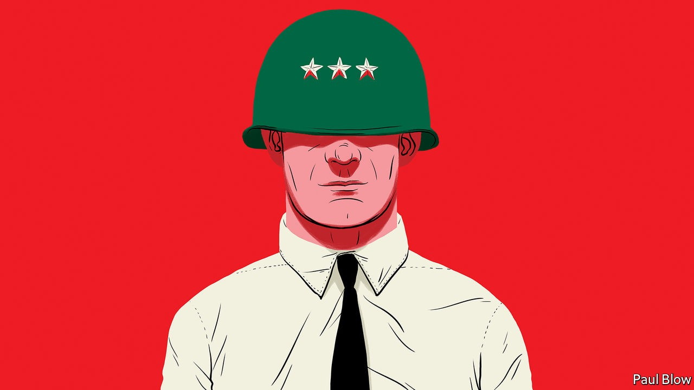

## Bartleby

# What the armed forces can teach business

> Fighting spirit

> Oct 24th 2020

WHEN CAPTAIN Gareth Tennant was patrolling with the Royal Marines in the Gulf of Aden in 2010, his team intercepted some Somali pirates on two skiffs. The pirates’ weapons were confiscated and the marines waited for clearance to release their prisoners. The plan was to tow the ne’er-do-wells back to Somali waters. But the pirates misread the troops’ intentions, and thought they were about to be abandoned at sea; a few jumped into the water while the rest attacked Mr Tennant’s team.

For a brief period, there was chaos. Mr Tennant was unable to give any orders. But his team acted anyway. One boat rescued the Somalis who had jumped into the water; another came alongside to offer support in ending the fight.

His team acted that way, Mr Tennant argues, because they were used to working with each other and they had war-gamed what might go wrong. In contrast, the pirates were suffering from fear, stress and fatigue, and acted on gut instinct. “If you haven’t gone through the decision-making process in advance, then gut instinct tends to kick in,” Mr Tennant says.

Now Mr Tennant is back in civilian life, acting as an adviser to the Future Strategy Club, an association of consultants. And he believes the habits learned in the Royal Marines can be useful for business life.

Given the long history of blunders in warfare (such as friendly-fire incidents), it may seem odd to turn to the armed forces for tips on efficiency. It is an old joke that “military intelligence” is an oxymoron. But many a corporate titan has sought wisdom in the philosophies of strategists like Sun Tzu and Carl von Clausewitz. And military expertise in emergencies was exploited by the British government to help build “Nightingale hospitals” early in the covid-19 pandemic, just as the armed forces had been used to counter Ebola in west Africa in 2014.

Soldiers regularly have to deal with the four forces dubbed VUCA (volatility, uncertainty, complexity and ambiguity). In particular, Mr Tennant cites the concept of mission command which developed during the Napoleonic wars. Armies found that, by the time messages had arrived at the front, the military situation had changed. The lesson was to establish what the army was trying to achieve before the battle and allow junior commanders to use their initiative and take decisions as the situation demanded.

The ideal command structure is not a rigid hierarchy, he argues, but a sphere, where the core sets the culture and the parts of the organisation at the edge are free to react to events outside them. In effect, the contrast is between centralised command and decentralised execution.

Business has been hit by two huge events this century: the financial crisis of 2007-09 and now the pandemic. These showed the extreme importance of resilience—and of preparation. The organisations that are dealing with the pandemic best are those which were already prepared for the unexpected, he says. The key lesson, Mr Tennant argues, was not having stocks of hand-sanitiser and plastic sheeting but knowing how to manage large changes in society and shifts in supply chains. It also requires training for the type of situations that managers may face.

Mr Tennant argues that in recent years companies have become overenamoured with predictive analytics, trying to make precise forecasts about the direction of markets. Instead, they should get involved in war-gaming, where they can discuss ideas that push the boundaries of what is possible. “The more we think about hypotheticals, the less space there is for unknown unknowns,” he says, echoing that well-known American strategist (and ex-defence secretary), Donald Rumsfeld. Corporate executives know their own business really well. But when the environment changes, experience counts for less. The answer is to apply a test and adjust the process, in a feedback cycle.

When a crisis happens, bosses display a tendency to hold on tight and take control. But that is losing the benefit of the diversity of the organisation, Mr Tennant thinks. Companies need those at the sharp end of the business to be adaptive and responsive. Senior managers need to relinquish authority and allow juniors to make decisions. In a crisis, companies which have invested in building up leaders at the lowest ranks of the organisation are more likely to prosper. In business, as in conflict, it isn’t the generals who carry the burden of the war; it’s the troops.

## URL

https://www.economist.com/business/2020/10/24/what-the-armed-forces-can-teach-business
