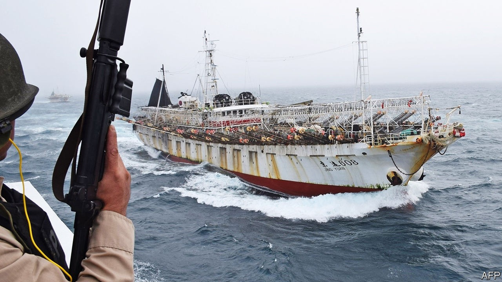
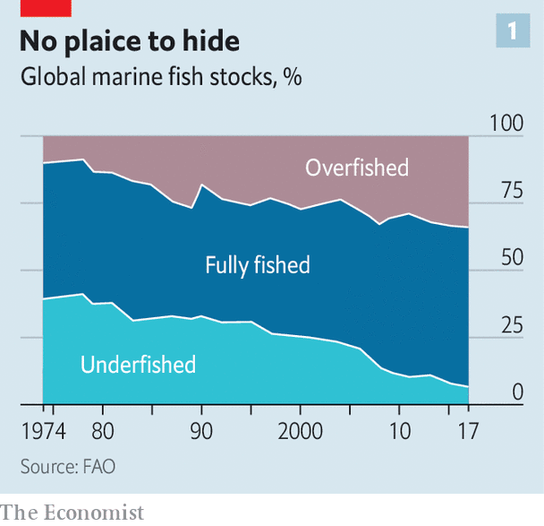
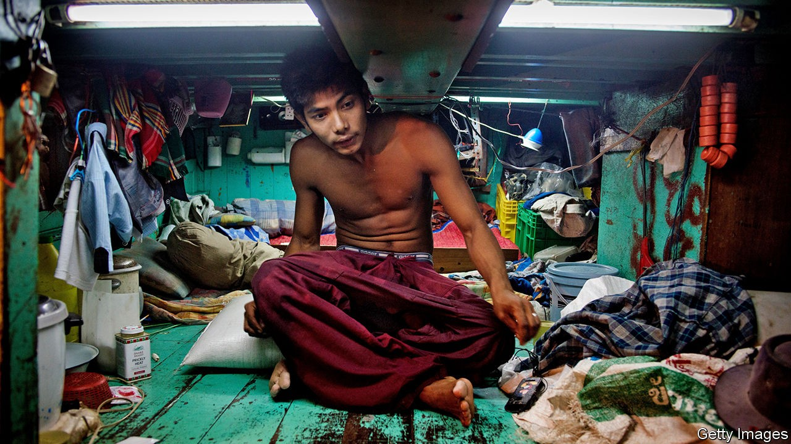
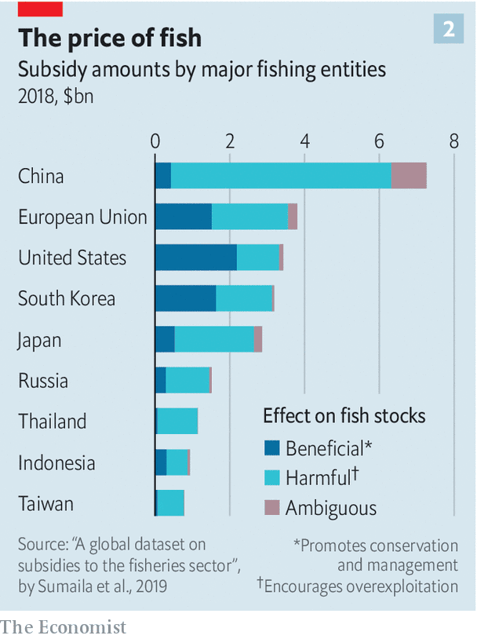

## The outlaw sea

# Illegal fishing fleets plunder the oceans

> They devastate seafood stocks and treat their crews abominably

> Oct 24th 2020GAMPO-EUP, HONIARA AND KAOHSIUNG

For more coverage of climate change, register for The Climate Issue, our fortnightly [newsletter](https://www.economist.com//theclimateissue/), or visit our [climate-change hub](https://www.economist.com//news/2020/04/24/the-economists-coverage-of-climate-change)

FOR SOME years wooden fishing boats, from another time as much as from another place, have been washing up on the western shores of Japan’s main island. Now numbering in the hundreds, these ghost boats are usually empty. Occasionally they contain the starved remains of North Korean fishermen. Life in North Korea is brutal and its fishing is primitive. But its inshore waters are known to have much marine life. Why would such unseaworthy craft head so far out to sea that they either get lost or are blown off course by the Sea of Japan’s notorious storms?

The mystery unravelled only recently, with the confirmation of another type of ghost ship. South Korea’s coastguard had for some time been aware of large Chinese fishing vessels steaming, fast and in single file, through South Korean waters. Their superstructures were festooned with racks of powerful electric bulbs—the identifying feature of squid boats, which use light to lure their prey from the depths at night. The Chinese skippers were less keen to attract the attention of the South Korean authorities. They had, in contravention of South Korean regulations, turned off their “automatic identification system”, or AIS. These transponders, which help prevent collisions, broadcast a vessel’s identity and position. When the Outlaw Ocean Project, a non-profit organisation with which The Economist collaborated on this story, put out to sea on a South Korean vessel in 2019 in hopes of collecting details on the Chinese fleet, one of nearly two-dozen Chinese vessels blared its horn, flashed its lights and veered towards the South Korean boat as if to ram it. The Koreans averted a potentially fatal collision by taking avoiding action when the Chinese vessel was metres away.

The South Korean authorities had asked Global Fishing Watch (GFW) to throw light on what the Chinese fleet was up to. GFW is another non-profit organisation set up four years ago by Google and others to monitor fishing around the world. It uses machine learning to overlay signals from vessels’ transponders (when switched on) with three types of satellite imagery: high-resolution optical images, images from cloud-penetrating radar, and infrared imagery that spots vessels operating at night. GFW’s conclusion was published in Science Advances in July: a “dark fleet” of nearly 1,000 industrial-sized Chinese fishing boats is hauling squillions of squid from the waters within North Korea’s 200-nautical-mile (370.4-km) exclusive economic zone each year. Squid is popular across East Asia, and demand is growing elsewhere, too—America imports 80,000 tonnes a year, most of it from China. Thanks to overfishing, South Korea and Japan have reported a fall in their catch of the Pacific flying squid of over four-fifths since 1983. That makes remaining stocks more valuable.

Yet the Chinese fleet’s activities in North Korean waters are certainly illegal. Possibly the Chinese Communist Party has struck a deal with the dictator, Kim Jong Un, for access to North Korean waters, in which case it is in breach of a UN Security Council resolution in 2017 imposing sanctions on the rogue regime for its nuclear weapons programme. More likely, its vessels are in North Korean waters without permission, in which case they are poaching on an industrial scale. Either way, China’s dark fleet is causing harm. Its depletion of coastal waters in the past few years coincides with a sharp rise in ghost boats washing up in Japan, as well as thousands of rickety North Korean boats entering Russian waters illegally. Desperate North Korean fisherfolk are having to go farther and farther to make their catch, leaving hungry villages full of widows behind.

China’s dark fleet is the world’s biggest, but it is not the only one. GFW and Trygg Mat Tracking, a Norwegian NGO that helps African states with fisheries intelligence, have uncovered nearly 200 Iranian fishing boats using drift nets to catch tuna off Somalia and Yemen. Epic, round-the-world chases by Sea Shepherd, a vigilante conservation group, to interdict rogue vessels fishing for the valuable Patagonian toothfish in the Southern Ocean have captured the imagination of ecowarriors.

The crimes of such vessels are one part of what is known as illegal, unreported and unregulated (IUU) fishing. As national, regional and multilateral bodies struggle with the damage overfishing causes to marine ecosystems (see chart), IUU fishing highlights the woeful state of governance on the waters that cover over two-thirds of the planet. Dodgy fishing drives a harpoon through efforts to make seafood supplies sustainable. One international study concludes that of 1,300 commercial species of fish and marine invertebrates, 82% are being removed faster than they can repopulate. Illicit boats not only net without restraint; they also deprive governments of billions of dollars from selling access to fisheries. And they threaten the livelihoods of tens of millions of small legal fishermen in Indonesia, west Africa, the Pacific Islands and other coastal states. Some go hungry because their waters have been feloniously fished.

Shortly after the GFW report came another discovery, this time by the Ecuadorean navy: a Chinese fleet fishing for squid right up against Ecuador’s exclusive economic zone around the (famously biodiverse) Galapagos islands. Many of the 260-odd boats are likely to have taken part in the North Korean fishing foray. Some of these vessels may have broken the law by switching off their transponders and sneaking into Ecuadorean waters. HawkEye 360, an American firm, used faint radio signals to identify vessels near the Chinese fleet that had gone “dark” within Ecuador’s exclusive zone. But establishing them to be Chinese fishing boats proved impossible. For the most part, the fleet did not appear to be breaking any laws. It was in international waters. And though international agreements exist for key fish stocks, notably commercial species of tuna, fishing for squid is not regulated. Chinese boats were taking rapacious advantage of that.

Even the legal presence of the Chinese fleet in this part of the eastern Pacific has consequences, says Enric Sala, National Geographic’s explorer-in-residence. At the turn of the year the fleet typically moves to the edge of the Argentine shelf, hoovering up squid before the start of the season that Argentina recognises in January—after the cephalopods have bred (a confrontation between the Argentine coastguard and a Chinese squid boat is pictured top). All this hurts the livelihoods of thousands of South American fishermen.

Duncan Copeland of Trygg Mat Tracking says it has also spotted Chinese fleets rapidly expanding squid fishing in two vast but little-documented patches of the Indian Ocean. Sucking up squid on this scale is troubling. Fleets are increasingly going after squid because they have fished out so many of their predators—a case of “fishing down the foodweb”. Squid are an important food source for many other species, including tuna, that local fleets want to catch. Squid also lead what Mr Sala calls a “superquick life”, growing, reproducing and dying in just a year. So when even squid populations are crashing, that is worrying.

The world is gradually waking up to the problem of dark fleets operating under cover of night or beyond the arm of the law. However, Mark Zimring of The Nature Conservancy, an environmental NGO, says that most illegal fishing takes place on licensed fleets. They are responsible for more than 90% of infractions in the southern Pacific. Instances might include skippers catching more fish than they have a permit for, or misreporting the species they have caught. In the Pacific and elsewhere, many vessels licensed to catch tuna are engaged in the finning of sharks. Illegal drift nets, as well as nets with too fine a mesh, kill vast quantities of by-catch—other fish species that are thrown back into the water—as well as protected animals such as the critically endangered vaquita porpoise found in the Gulf of California.

With so many vessels up to no good, the agencies meant to enforce the rules are outmatched. Many are poorly staffed and trained, especially in the poor countries of west and east Africa, South-East Asia and the Pacific. The coronavirus has made matters worse. In July the Western and Central Pacific Fisheries Commission, which oversees the world’s biggest tuna fishery, absolved fishing boats purse-seining for tuna from carrying a fisheries observer.

Then there is the treatment of crews. Fishing has always been a dangerous profession. It is sometimes lucrative, but more often not. In Asia forced labour is rampant, as are other abuses of workers. Thailand has a huge fishery. But few Thais want to join it, leaving the fleet short of about 50,000 seamen a year. Tens of thousands of migrants from Cambodia and Myanmar are whispered into Thailand each year to make up the numbers (one is pictured on a boat below).

Unscrupulous captains buy and sell these men and boys like chattel. Your correspondent joined a vessel that fished about 100 miles off the Thai coast. Three dozen Cambodian men and boys worked barefoot, in 15-foot swells, on a deck made slippery by fish guts and ice, an obstacle course of jagged tackle and spinning winches. One boy proudly showed off two missing fingers, caught between a net and a drum. Some crew members’ hands had open wounds, the deepest of which they stitched up themselves. The captain had plenty of amphetamine to distribute, but no antibiotics. Shifts ran to 20 hours. Food was a once-daily bowl of rice, flecked with boiled squid. Drinking water was rationed. The whole ship crawled with cockroaches. Rats were as carefree as city squirrels.

Reports from Asian distant-water fleets are also horrific. In July Indonesian police impounded two Chinese vessels and arrested executives of a recruitment agency over the mistreatment of Indonesian crew members, one of whom was found dead in a deep freeze. The environmental and labour practices of Taiwan’s fleet were so egregious that in 2015 the European Union threatened to stop importing Taiwanese seafood. One Filipino former crew member of the Da Wang, a Taiwanese vessel registered in Vanuatu, says the skipper frequently punched him in the back of the head to make him work harder and whirled a large hook around to intimidate. The Filipino says he witnessed the first officer beat an Indonesian crew member, who later died. He says that after the vessel returned to Taiwan its owners and the recruitment agency threatened him. He is in hiding and giving evidence to an investigation.

The government has since tightened regulations governing the welfare of 35,000-odd foreign crewmen. Yet in October America’s Department of Labour classified fish caught by Taiwan’s long-distance fleet—with 1,100 vessels second only to China’s—as the products of forced labour. It said crews on Taiwanese vessels “face confiscation of documents, long days with little rest, physical and verbal abuse, and lack of payment”. Though the American government has yet to ban seafood from Taiwan, at a minimum American companies sourcing fish from Taiwan now face closer scrutiny at customs.

The Pacific’s tuna fishery has recorded one or two suspicious deaths of on-board fisheries observers every year since 2015—perhaps after seeing what they should not have. In March a Kiribati fisheries observer was found dead on a Taiwan-flagged tuna boat with a blow to the back of his head. His case is being treated as murder. The presence of one type of crime suggests the likelihood of others, says Emma Witbooi, one author of a report on organised crime in fisheries put out by the High Level Panel for a Sustainable Ocean Economy, a Norwegian-led initiative. Increasingly, fishing is used as a cover for running guns and drugs, trafficking labour and laundering money.

Belatedly, governments, multilateral institutions, conservation groups and even fishing interests are recognising the scale of illicit fishing and resolving to tackle it. Sally Yozell of the Stimson Centre, a think-tank in Washington, DC, estimates that illegal, unreported and unregulated fishing generates profits of $36bn a year and could account for between 20% and 50% of the global fish catch. Nearly everyone who has eaten fish has eaten the dodgy sort.

As work uncovering dark fleets is showing, technology can help curb maritime malefactors. At the Forum Fisheries Agency in Honiara, capital of the Solomon Islands, a giant screen covers one wall, showing a satellite view of the whole Pacific. The intergovernmental agency, backed by Australia, New Zealand and other donors, is tasked with helping 17 Pacific island states manage migratory tuna stocks within their vast exclusive economic zones. The screen shows the position of all tuna vessels licensed to fish in the members’ waters, broadcast via satellite. Most vessels are depicted as tiny green tadpoles, with tails showing their recent track. But some of them—one stationary in a Chinese port, another steaming towards Palau—are marked in red. Matthew Hooper, the agency’s deputy director, says that these vessels have either been caught red-handed or are suspected of having fished illegally. They are closely watched.

Experts say the scope for better monitoring is growing. For instance, when two vessels can be seen meeting far out at sea, it raises a red flag: they could be trans-shipping an illegal catch. For that reason, Mr Hooper says, Pacific countries are pushing for greater regulation of at-sea trans-shipment, even outside their waters, for tuna longline vessels they license to fish.

Mr Zimring says the next move is to bring electronic monitoring onto vessels themselves. Australian, American and Chilean boats are adopting on-board cameras that start recording when, for instance, a winch drum turns or a seine net is shot. In future the data might be processed with the help of machine learning to help spot abnormal behaviour. The Nature Conservancy says it is working with casino-security experts to improve the algorithms. Mr Zimring notes that these monitoring systems do not sleep or get sick, and cannot be bribed or knocked on the head.

Two other tasks are essential. One is to chase crime ashore. In the rare instances where fisheries infractions are punished, it is almost always through a fine on the vessel or its skipper. Cases rarely go to court. Many criminals see fines as a cost of doing business, says Mr Copeland of Trygg Mat Tracking. Fisheries inspectors have a narrow purview. Too often operators involved in crew abuse, drug-running and other crimes not connected to fishing risk punishment only for minor offences such as being caught with too fine a net. Vessels frequently change name or flag of convenience, while owners hide behind brass-plate companies or opaque joint ventures. Ms Witbooi says a more sophisticated approach is needed to go after the invisible owner who is the ultimate beneficiary of crimes at sea. It is like chasing the mafia.

Above all, governments must cut subsidies for fishing fleets, economists suggest. These are by far the biggest factor motivating iffy fishing. Over $35bn of subsidies a year goes to fishing interests around the world (see chart). Much of that is well-intentioned, such as money that helps artisanal fishermen through support for small inshore fisheries. But roughly $22bn a year harms global fish stocks. Most is for fuel.

One of the world’s most environmentally destructive fisheries is bottom-trawling off the coast of west Africa. It turns the seabed into a wasteland. Most of it is done by Chinese operators working under the guise of joint ventures with well-connected locals. It is fuel-intensive. Without diesel subsidies, says National Geographic’s Mr Sala, this fishery would close tomorrow.

Without subsidies, China’s dark fleets in the eastern Pacific and the Indian Ocean would also be gone. Experts reckon that an end to subsidies and to forced labour would render half of all high-seas fishing unprofitable. Less fishing on the high seas would allow stocks of many species to recover. But the benefits go further, says Mr Sala: if just a fraction of the world’s harmful subsidies were diverted to better managing (more productive) coastal fisheries, a huge rebound in inshore stocks could take place, providing better food security and millions of jobs. In talks at the World Trade Organisation on limiting fishing subsidies, the Chinese government has proposed curbing others’ subsidies while protecting its own. But as this year’s furore over dark fleets shows, the cost to its reputation is rising.■

## URL

https://www.economist.com/international/2020/10/24/illegal-fishing-fleets-plunder-the-oceans
